# Bitácora del TFG

Diario de trabajo del Trabajo de Fin de Grado (Ingeniería Industrial):
*generación automática de aceleradores hardware mediante LLMs con
validación en lazo cerrado sobre el lenguaje Allo*.

Formato: fecha, qué se decidió/hizo, qué problemas surgieron y cómo se
resolvieron. Pensado para poder citar en la memoria el "por qué" de cada
decisión sin tener que reconstruirlo de memoria al final.

---

## Arranque del proyecto: arquitectura de agentes

**Contexto.** Recibido por correo el planteamiento del proyecto: generación
automática de código RTL (comunicaciones/procesado de señal — 5G/6G, radar)
mediante LLMs restringidos al DSL Allo (Cornell), con validación en cascada
usando el propio compilador de Allo como oráculo (parseo → tipos → ejecución
contra golden model → equivalencia formal → HLS), y un lazo de reparación
que realimenta los errores al modelo hasta converger.

**Decisión de arquitectura.** Se plantea un pipeline de **3 agentes**
interconectados en vez de un único agente monolítico:

1. **Generador** — escribe código Allo (kernel + schedule) dentro de un
   subconjunto restringido del lenguaje (solo tipos de `allo.ir.types`,
   `allo.grid`, `range`, sin imports externos).
2. **Ejecutor** — corre la cascada de validación real (L1 sintaxis/tipos,
   L2 funcional contra golden model, L3 equivalencia formal de schedules,
   L4 síntesis HLS).
3. **Validador** — traduce la salida cruda del Ejecutor en un informe
   estructurado (JSON tipado) y decide la política de escalada:
   continuar, regenerar desde cero, o congelar el kernel y tocar solo el
   schedule.

**Por qué esta separación de roles** (y no un solo agente que hace todo):
cada rol necesita un contexto y unas herramientas distintas — el Generador
no necesita ejecutar nada, el Ejecutor no necesita "pensar" en lenguaje
natural, y el Validador necesita producir una salida con forma fija para
que el bucle pueda tomar decisiones automáticas sin parsear texto libre.

**Herramienta elegida: Claude Agent SDK.** Se descarta escribir el propio
orquestador de agentes desde cero — el SDK ya da subagentes, herramientas
personalizadas (MCP en proceso), hooks para telemetría, y salidas
estructuradas, que es justo lo que pedía la arquitectura del correo
original.

**Primer esqueleto de código.** Se crea un proyecto Python con:
- `schemas.py` — esquema tipado (Pydantic) del informe del Validador
  (`InformeValidacion`: nivel de fallo, mensaje accionable, diff numérico,
  métricas HLS, decisión de escalada).
- `allo_tools.py` — herramientas del Ejecutor que envuelven la cascada
  L1-L4 del toolchain de Allo (mockeadas al principio, para poder probar
  el bucle completo sin tener Allo instalado todavía).
- `orchestrator.py` — el bucle explícito: Generador → Ejecutor → Validador
  → decisión de escalada, con presupuesto máximo de iteraciones.
- `spec_example.yaml` — primer bloque de prueba: una mariposa FFT
  radix-2 (Cooley-Tukey).

**Decisión sobre orquestación:** explícita en Python (llamadas directas a
`query()` por rol) en vez de dejar que el propio SDK gestione subagentes
automáticamente — se necesita control fino sobre la cascada L1-L5 y la
política de escalada (congelar kernel vs. regenerar desde cero), que es
lógica muy específica del dominio.

---

## Entorno de desarrollo, Allo, y estructura de TFG

**Entorno base en Windows.** Instalación de Node.js, Python, el SDK
(`claude-agent-sdk`), y autenticación con la API. Problemas menores
resueltos: política de ejecución de PowerShell bloqueando `npm`
(`Set-ExecutionPolicy -Scope CurrentUser -ExecutionPolicy RemoteSigned`), y
una API key mal configurada (se guardó el *nombre* de la clave en vez del
valor real).

**Decisión: usar la suscripción Pro en vez de una API key de pago por
uso.** Se confirma que el uso automatizado (Agent SDK / bucles sin
intervención humana) sigue contando dentro de la cuota de Claude Pro
mientras Anthropic mantenga pausado el cambio de facturación anunciado
para el 15 de junio de 2026 — evita tener que cargar saldo en la consola
de API para las pruebas de desarrollo.

**Integración de Allo (real).** Se descubre que Allo depende de compilar
LLVM/MLIR y solo da soporte oficial para Linux (imagen Docker
`chhzh123/allo:latest`, o compilación desde fuente). No hay instalación
nativa en Windows. Además, el repo usa **submódulos de git** — el ZIP de
GitHub no los incluye, así que hay que clonar con
`git clone --recursive`.

**Decisión: entorno unificado en un contenedor** en vez de cruzar llamadas
Windows↔Docker en cada iteración del bucle

Se instala el toolchain de Allo desde fuente, sustituyendo la dependencia
mockeada en `allo_tools.py`. El proceso reveló una cadena de tres/cinco
problemas encadenados, cada uno enmascarando al siguiente — merece la pena
documentarlos con detalle porque la causa raíz de cada uno solo se hizo
visible al resolver el anterior.

**1. `LLVM_BUILD_DIR` no configurado.** Allo no compila su propia copia de
LLVM/MLIR — asume un build externo ya hecho, apuntado vía variable de
entorno. Se compiló LLVM 19 (commit pinned por Allo) desde
`external/allo/externals/llvm-project`, con:

```bash
cmake -G Ninja ../llvm \
  -DLLVM_ENABLE_PROJECTS=mlir \
  -DLLVM_BUILD_EXAMPLES=ON \
  -DLLVM_TARGETS_TO_BUILD="host" \
  -DCMAKE_BUILD_TYPE=Release \
  -DLLVM_ENABLE_ASSERTIONS=ON \
  -DLLVM_INSTALL_UTILS=ON \
  -DMLIR_ENABLE_BINDINGS_PYTHON=ON \
  -DPython3_EXECUTABLE=$(which python3)
ninja
```

(≈2 horas, 855 pasos de compilación).

**2. Aislamiento de build de pip rompía la detección de `ninja`.** El
primer intento de `pip install -e .` fallaba con
`RuntimeError: LLVM_BUILD_DIR environment variable is not set` y, tras
exportar la variable, con un error posterior de `ninja: no such file or
directory`. La causa: pip crea un entorno aislado temporal (`overlay`)
para las dependencias declaradas en `pyproject.toml`, y el binario
`ninja` de PyPI instalado ahí no se resolvía correctamente en ese
entorno. Solución: forzar a pip a reutilizar las herramientas del
sistema (`ninja-build` y `cmake` ya instalados vía `apt`):

```bash
pip install --break-system-packages --no-build-isolation -v -e .
```

**3. `nanobind` no instalado.** Al resolver (2), apareció un error más
simple: `RuntimeError: nanobind is not installed`. Se instaló con
`pip install --break-system-packages nanobind`.

**4. `MLIRConfig.cmake` no se generó en la build inicial de LLVM**, aunque
`LLVMConfig.cmake` sí existía en `build/lib/cmake/llvm/`. Al faltar, el
`find_package(MLIR)` del `CMakeLists.txt` de Allo fallaba con
`Could not find a package configuration file provided by "MLIR"`.
Se confirmó que `LLVM_ENABLE_PROJECTS=mlir` sí estaba activo en la
caché de CMake, y que `tools/mlir` sí se había compilado — el problema
era solo la generación del archivo de configuración exportable. Se
resolvió reconfigurando in-place (sin recompilar nada) dentro del build
de LLVM:

```bash
cd external/allo/externals/llvm-project/build
cmake .
```

Bastaron unos segundos para que se regenerara `lib/cmake/mlir/MLIRConfig.cmake`.

**5. Consecuencia de (4): `mlir-tblgen` y otros binarios de MLIR nunca se
habían compilado.** La build original de Ninja (855 pasos) se había
completado *antes* de que la configuración de MLIR quedara resuelta, así
que el propio `build.ninja` de aquel momento no incluía los targets de
MLIR. Al reintentar `pip install` de Allo, fallaba con:os de fallo). Se
escribe un `Dockerfile` que parte de la imagen oficial de Allo y añade
Node.js + Claude Code CLI + el SDK de Python encima.

**Reestructuración como TFG.** Al confirmarse que este es el Trabajo de
Fin de Grado, se reorganiza todo bajo una estructura de proyecto académico
(`C:\TFG`, fuera de `Documents` para evitar interferencias de OneDrive y
límites de longitud de ruta de Windows):

```
TFG/
├── docs/            (esta bitácora, notas de instalación)
├── docker/          (Dockerfile)
├── src/agentes/     (el pipeline de 3 agentes)
├── specs/           (specs de bloques, p. ej. spec_example.yaml)
├── external/allo/   (Allo como git submodule — permite citar el commit exacto)
└── results/catalogo/ (kernels validados + métricas, según vaya creciendo)
```

**Repositorio en GitHub.** Se crea `TFG-Allo-Agents` como repositorio
**privado** (pendiente de confirmar con el tutor si hay alguna norma de
confidencialidad específica de la universidad antes de hacerlo público).
Allo se añade como **git submodule** (no como clon normal) para poder citar
en la memoria el commit exacto usado, y para no mezclar el historial de
Allo con el del TFG. Autenticación con GitHub vía `gh auth login` en vez de
contraseña (GitHub ya no acepta contraseña plana por `git push`).

---

## Problemas de virtualización en Windows, cambio a Linux

**Intento de levantar Docker Desktop en Windows.** Error
`Virtualization support not detected`. Se descarta que sea por tener
Windows Home (Docker Desktop funciona en Home vía backend WSL2, no
necesita Hyper-V). Se investigan varias causas posibles a lo largo del
día: BIOS/SVM Mode (ya estaba activado), funciones opcionales de Windows
(`VirtualMachinePlatform`, WSL — activadas correctamente solo tras
ejecutar los comandos con PowerShell en modo Administrador, que al
principio no lo estaba), driver residual de VirtualBox (descartado, no
quedaba ninguno), y antivirus de terceros interfiriendo con el hipervisor
(descartado, solo Windows Defender). Ninguna de estas resolvió el problema
— quedó sin diagnosticar la causa raíz exacta en este equipo concreto
(hipótesis más probable: la Seguridad Basada en Virtualización de Windows
11 25H2 reservando el hipervisor de forma exclusiva para Credential Guard,
sin dejar partición libre para WSL2).


*Figura 1. Pantalla de error de Docker Desktop en el equipo Windows de pruebas. El motor queda en estado `Engine stopped` y el arranque no llega a completarse pese a haber descartado las causas habituales (BIOS, VirtualBox, antivirus). Causa raíz no confirmada; hipótesis principal: reserva exclusiva del hipervisor por VBS/Credential Guard en Windows 11 25H2.*

**Decisión: usar un segundo ordenador con Linux nativo** en vez de seguir
depurando la virtualización de Windows. Justificación: Allo está pensado
para Linux de origen — evitar la capa de virtualización elimina de raíz la
categoría entera de problemas que estábamos teniendo, sin perder tiempo en
un diagnóstico que no era imprescindible para el progreso del proyecto (se
puede retomar más adelante si hace falta reproducir el entorno también en
Windows).

**Entorno validado en Linux.** Clonado del repositorio (`git clone
--recurse-submodules`), instalación de dependencias, `claude login` con la
cuenta Pro, y ejecución de `test_minimo.py` — confirmado
`apiKeySource: none` (usando la suscripción, no facturación de API) y
respuesta correcta del modelo, tanto desde Claude Code como desde una
terminal normal de forma independiente.

**Primera comprobación: dentro de Claude Code (sesión interactiva).**
Antes de validar el entorno "en frío" desde una terminal corriente, se hizo
una primera comprobación rápida dentro de la propia sesión de Claude Code
usada para desarrollar el código, pidiéndole textualmente que comprobara el
login y ejecutara `test_minimo.py`.


*Figura 2. Sesión interactiva de Claude Code (v2.1.220) en `~/TFG/src/agentes`. Claude Code confirma que la sesión ya estaba autenticada con la cuenta Pro (`pafracal@gmail.com`) y razona correctamente que, como `test_minimo.py` usa `claude_agent_sdk`, que a su vez invoca el mismo CLI de `claude`, debería quedar autenticado sin pasos adicionales. A continuación ejecuta `test_minimo.py` con éxito ("the assistant replied `funciona`"). En la línea de comandos, ya tecleado y a la espera de confirmación, se aprecia el siguiente paso natural: `run orchestrator.py` — es decir, la tentación de seguir pidiéndole a Claude Code que ejecute también el pipeline completo.*

**Por qué esta comprobación no se usó como validación del entorno, y por
qué no se debe operar el pipeline desde dentro de Claude Code.** El
resultado de la Figura 2 es correcto, pero se descartó deliberadamente como
prueba válida, y se decidió no continuar por ese camino (no se llegó a
escribir `run orchestrator.py`), por dos motivos:

1. **Contaminaría la validación del sistema.** El objetivo del proyecto es
   un pipeline **autónomo**: un script (`orchestrator.py`) que encadena
   Generador → Ejecutor → Validador en bucle, sin intervención humana en
   cada iteración. Si la comprobación de que "funciona" se hace pidiéndoselo
   a Claude Code de forma conversacional, no queda claro si el mérito es
   del propio script o de alguna gestión de contexto/autenticación que
   Claude Code está haciendo por detrás sin que sea evidente desde fuera.
   La única prueba inequívoca de que el sistema es autónomo es que corra
   igual de bien invocado directamente (`python3 test_minimo.py`,
   `python3 orchestrator.py`) desde una terminal corriente, sin ningún
   asistente conversacional de por medio.
2. **Contradiría el objetivo del propio TFG.** Todo el proyecto gira en
   torno a demostrar un lazo de generación-validación que no necesita
   supervisión humana turno a turno. Operar el pipeline pidiéndoselo
   manualmente a un asistente interactivo, aunque sea cómodo durante el
   desarrollo, es exactamente el patrón contrario al que se quiere
   demostrar que funciona.

**Regla práctica adoptada a partir de este punto:** Claude Code se usa
únicamente para escribir y depurar código; toda ejecución que cuente como
resultado o evidencia del proyecto se hace siempre mediante invocación
directa desde terminal, sin mediación de ningún asistente conversacional.

**Entorno validado en Linux (terminal directa).** Clonado del repositorio
(`git clone --recurse-submodules`), instalación de dependencias, `claude
login` con la cuenta Pro, y ejecución de `test_minimo.py` **directamente
desde terminal**, siguiendo la regla anterior — confirmado
`apiKeySource: none` (usando la suscripción, no facturación de API) y
respuesta correcta del modelo.


*Figura 3. Salida completa de `python3 test_minimo.py` invocado directamente desde terminal (sin Claude Code de por medio), en contraste con la Figura 2. El `SystemMessage` confirma `apiKeySource: 'none'` (autenticación vía suscripción Pro, no API de pago por uso); el `AssistantMessage` devuelve el texto esperado (`'funciona'`); el `RateLimitEvent` confirma cuota de cinco horas con `overageDisabledReason: 'org_level_disabled'` (sin riesgo de facturación adicional); y el `ResultMessage` cierra con `is_error=False`. Esta es la ejecución que se toma como validación real del entorno, precisamente por no depender de ningún asistente interactivo.*

**Primera ejecución del pipeline completo (con Allo aún mockeado).**
Se detectan y corrigen dos errores de integración al ejecutar
`orchestrator.py` por primera vez fuera de la carpeta original:
1. Ruta relativa a `spec_example.yaml` rota tras mover el archivo a
   `specs/` — corregido a `../../specs/spec_example.yaml` desde
   `src/agentes/`.
2. `mcp_servers` pasado como lista (`[allo_tools_server]`) en vez de
   diccionario (`{"allo-tools": allo_tools_server}`) al configurar las
   herramientas del Ejecutor — el SDK esperaba un mapeo nombre→servidor,
   no una lista, y lo interpretaba erróneamente como ruta a un archivo de
   configuración.


*Figura 4. Salida de terminal de la primera ejecución de `orchestrator.py` desde su ubicación definitiva. Se observa, al inicio, el rastro del primer error ya resuelto (`FileNotFoundError: 'spec_example.yaml'`); a continuación, el código Allo generado por el agente Generador para el bloque `fft_radix2` (kernel de mariposa FFT radix-2, bucle `allo.grid(H)` con `H=512`); y finalmente el error `Invalid MCP configuration: MCP config file not found`, producido porque el SDK interpretó la lista `[allo_tools_server]` como ruta a un archivo de configuración en lugar de como el servidor MCP ya instanciado — confirmando el segundo bug descrito en el punto 2 anterior. Captura tomada **antes** de aplicar la corrección (diccionario `{"allo-tools": allo_tools_server}`); se conserva como evidencia del proceso de depuración, no como estado final del sistema.*

**Estado al cierre de esta sesión:** el Generador produce código Allo
plausible para la FFT radix-2 de prueba; el Ejecutor y el Validador están
en proceso de validarse con las herramientas aún mockeadas (pendiente de
confirmar una iteración completa exitosa tras el último arreglo).

---

## Arreglo del `mcp_servers`, primera iteración completa y persistencia del catálogo

**Contexto.** Pendiente de la sesión anterior: confirmar que `orchestrator.py`
completa una iteración entera con las herramientas del Ejecutor aún
mockeadas, y verificar que el bug de `mcp_servers` (pasado como lista en vez
de diccionario) estaba realmente corregido en el código.

**Bug confirmado: `mcp_servers` como lista en vez de diccionario.** Al
revisar `orchestrator.py`, el bug seguía presente en `llamar_ejecutor()`:

```python
# Antes (incorrecto)
opciones = ClaudeAgentOptions(
    mcp_servers=[allo_tools_server],   # lista -> el SDK lo trata como ruta a config
    ...
)
```

`ClaudeAgentOptions` espera un **diccionario** `nombre -> servidor`, no una
lista. Al pasar una lista, el SDK intenta interpretar cada elemento como una
ruta a un archivo de configuración MCP externo (formato stdio/HTTP), no como
un objeto de servidor en proceso ya instanciado — el mismo tipo de error de
"Invalid MCP configuration" ya documentado en la Figura 4, pero esta vez
manifestado como `claude_agent_sdk._errors.ProcessError: Command failed
with exit code 1` en una ejecución posterior.

Arreglo aplicado:

```python
# Después (correcto)
opciones = ClaudeAgentOptions(
    mcp_servers={"allo-tools": allo_tools_server},
    allowed_tools=[
        "mcp__allo-tools__run_l1_parse_types",
        "mcp__allo-tools__run_l2_functional",
        "mcp__allo-tools__run_l3_equivalence",
        "mcp__allo-tools__run_l4_hls",
    ],
)
```

El nombre `"allo-tools"` en el diccionario debe coincidir con el prefijo
`mcp__allo-tools__` usado en `allowed_tools`.


*Figura 5. Terminal con el rastro (scroll hacia arriba) del `ProcessError: Command failed with exit code 1` de una ejecución anterior al arreglo del diccionario `mcp_servers`, seguido inmediatamente de una ejecución ya corregida de `orchestrator.py`: iteración 1 falla en L1 (falta `return` en el kernel generado), iteración 2 genera un kernel con tabla de twiddle factors precalculada, pasa L1-L3 y alcanza II=1 en L4, cerrando con `✅ Éxito. Guardando en el catálogo.`*

**Primera iteración completa confirmada.** Con el arreglo aplicado, se
ejecuta `orchestrator.py` limpio desde `src/agentes/`:

```bash
cd ~/TFG/src/agentes
python3 orchestrator.py
```

Resultado:
- **Iteración 1/6:** el Generador escribe un kernel con una tabla de
  twiddle factors precalculada como lista de literales (`TWID_COS = [...]`).
  Falla en **L1** porque falta la sentencia `return` en el kernel — el
  Validador devuelve `decision=CONTINUAR` con el mensaje accionable
  correspondiente.
- **Iteración 2/6:** el Generador corrige el enfoque, esta vez generando
  los twiddle factors por rotación iterativa (`COS_STEP`, `SIN_STEP`) en
  vez de una tabla de literales, e incluye el `return`. Pasa las 4 capas
  (L1 sintaxis/tipos, L2 funcional contra `fft_radix2_numpy_reference`, L3
  equivalencia de schedule, L4 síntesis HLS con II=1 exacto).
- Resultado final: `✅ Éxito. Guardado en el catálogo:
  ../../results/catalogo/fft_radix2.json`


*Figura 6. Salida completa de la ejecución de `orchestrator.py` ya con el arreglo de `mcp_servers` aplicado, mostrando la corrección automática entre iteración 1 y 2, y el mensaje final de guardado en `results/catalogo/fft_radix2.json`.*

**Bug encontrado: el catálogo no se persistía a disco.** Al revisar el
código tras el primer `✅ Éxito`, se detecta que el mensaje "Guardando en el
catálogo" era engañoso: solo hacía `catalogo_validados.append(...)` a una
lista **en memoria**, local a `main()`. Al terminar el script, esa lista se
perdía — no se escribía nada a `results/catalogo/`, a pesar de que la
carpeta ya existía en la estructura del repo para ese propósito.

Arreglo aplicado: nueva función `guardar_en_catalogo()` en
`orchestrator.py` que escribe un JSON a `results/catalogo/<bloque>.json`
(el nombre del bloque viene del campo `spec["bloque"]`) con la spec
completa, el código Allo generado (kernel + schedule) y las métricas HLS:

```python
def guardar_en_catalogo(spec: dict, codigo: str, metricas: dict | None) -> str:
    os.makedirs(DIR_CATALOGO, exist_ok=True)
    registro = {
        "bloque": spec.get("bloque", "sin_nombre"),
        "spec": spec,
        "codigo_allo": codigo,
        "metricas_hls": metricas,
    }
    ruta = os.path.join(DIR_CATALOGO, f"{registro['bloque']}.json")
    with open(ruta, "w") as f:
        json.dump(registro, f, indent=2, ensure_ascii=False)
    return ruta
```

Llamada desde `main()` en el momento de éxito, sustituyendo el `print` que
no hacía nada:

```python
if informe.nivel_fallo == NivelFallo.NINGUNO:
    ruta = guardar_en_catalogo(spec, codigo, informe.metricas_hls)
    print(f"\n✅ Éxito. Guardado en el catálogo: {ruta}")
    ...
```

Verificado con `cat ../../results/catalogo/fft_radix2.json` — el archivo
contiene la spec, el código Allo (kernel con rotación iterativa de twiddle
factors + schedule con `pipeline("k")` y `pipeline("kb")` a II=1), y las
métricas mockeadas (`II=1, latencia=42, BRAM=4, DSP=8, LUT=1200`).

**Nota importante:** estas métricas siguen siendo del mock de
`run_l4_hls` (valores fijos salvo el II) — no representan una síntesis
real todavía. Sirven para confirmar que el *mecanismo* de persistencia
funciona de punta a punta, no para sacar conclusiones sobre recursos reales
de hardware.

**Estado al cierre de esta sesión:** el punto pendiente de confirmar la
iteración completa mockeada queda **cerrado** — el pipeline corre de
principio a fin, con reintento tras fallo en L1 y éxito en la siguiente
iteración, y ahora sí persiste el resultado en `results/catalogo/`.

---
## Instalación real de Allo (sustituyendo el mock)

Se instala el toolchain de Allo desde fuente, sustituyendo la dependencia
mockeada en `allo_tools.py`. El proceso reveló una cadena de tres/cinco
problemas encadenados, cada uno enmascarando al siguiente — merece la pena
documentarlos con detalle porque la causa raíz de cada uno solo se hizo
visible al resolver el anterior.

**1. `LLVM_BUILD_DIR` no configurado.** Allo no compila su propia copia de
LLVM/MLIR — asume un build externo ya hecho, apuntado vía variable de
entorno. Se compiló LLVM 19 (commit pinned por Allo) desde
`external/allo/externals/llvm-project`, con:

```bash
cmake -G Ninja ../llvm \
  -DLLVM_ENABLE_PROJECTS=mlir \
  -DLLVM_BUILD_EXAMPLES=ON \
  -DLLVM_TARGETS_TO_BUILD="host" \
  -DCMAKE_BUILD_TYPE=Release \
  -DLLVM_ENABLE_ASSERTIONS=ON \
  -DLLVM_INSTALL_UTILS=ON \
  -DMLIR_ENABLE_BINDINGS_PYTHON=ON \
  -DPython3_EXECUTABLE=$(which python3)
ninja
```

(≈2 horas, 855 pasos de compilación).

**2. Aislamiento de build de pip rompía la detección de `ninja`.** El
primer intento de `pip install -e .` fallaba con
`RuntimeError: LLVM_BUILD_DIR environment variable is not set` y, tras
exportar la variable, con un error posterior de `ninja: no such file or
directory`. La causa: pip crea un entorno aislado temporal (`overlay`)
para las dependencias declaradas en `pyproject.toml`, y el binario
`ninja` de PyPI instalado ahí no se resolvía correctamente en ese
entorno. Solución: forzar a pip a reutilizar las herramientas del
sistema (`ninja-build` y `cmake` ya instalados vía `apt`):

```bash
pip install --break-system-packages --no-build-isolation -v -e .
```

**3. `nanobind` no instalado.** Al resolver (2), apareció un error más
simple: `RuntimeError: nanobind is not installed`. Se instaló con
`pip install --break-system-packages nanobind`.

**4. `MLIRConfig.cmake` no se generó en la build inicial de LLVM**, aunque
`LLVMConfig.cmake` sí existía en `build/lib/cmake/llvm/`. Al faltar, el
`find_package(MLIR)` del `CMakeLists.txt` de Allo fallaba con
`Could not find a package configuration file provided by "MLIR"`.
Se confirmó que `LLVM_ENABLE_PROJECTS=mlir` sí estaba activo en la
caché de CMake, y que `tools/mlir` sí se había compilado — el problema
era solo la generación del archivo de configuración exportable. Se
resolvió reconfigurando in-place (sin recompilar nada) dentro del build
de LLVM:

```bash
cd external/allo/externals/llvm-project/build
cmake .
```

Bastaron unos segundos para que se regenerara `lib/cmake/mlir/MLIRConfig.cmake`.

**5. Consecuencia de (4): `mlir-tblgen` y otros binarios de MLIR nunca se
habían compilado.** La build original de Ninja (855 pasos) se había
completado *antes* de que la configuración de MLIR quedara resuelta, así
que el propio `build.ninja` de aquel momento no incluía los targets de
MLIR. Al reintentar `pip install` de Allo, fallaba con:

```bash
ninja: error: '.../llvm-project/build/bin/mlir-tblgen', needed by
'...', missing and no known rule to make it
```
Se relanzó Ninja en el build de LLVM (incremental — no repitió los 855
pasos ya hechos, solo compiló los targets de MLIR que faltaban,
incluyendo `mlir-tblgen`):

```bash
cd external/allo/externals/llvm-project/build
ninja -j2
```

**6. Caché de CMake obsoleta en `allo/mlir/build/CMakeCache.txt`** seguía
apuntando al `ninja` roto del punto (2) incluso después de añadir
`--no-build-isolation` — CMake reutilizaba la configuración cacheada de
un intento anterior en vez de reevaluar el comando nuevo. Hubo que
localizar y borrar esa carpeta de build concreta (no la de LLVM, que
estaba bien) para forzar una reconfiguración limpia:

```bash
rm -rf external/allo/mlir/build
```

**Resultado.** Tras resolver los seis puntos:

```bash
pip install --break-system-packages --no-build-isolation -v -e .
```

completó con éxito (`Successfully installed allo-0.5 astpretty-3.0.0
astroid-3.0.3 black-24.8.0 ...`), y:

```bash
python3 -c "import allo; import allo.ir; print('OK')"
```

confirma `OK`. El toolchain de Allo ya está disponible en el mismo
entorno Python que usa el orquestador, lo que desbloquea el trabajo
pendiente de sustituir las funciones `MOCK_*`.

## L1 conectado a Allo real: bug de `inspect.getsource()` y primera cascada completa

**Contexto.** Con Allo ya instalado de verdad en el entorno Linux, se conecta
el primer nivel de la cascada de validación (`run_l1_parse_types` en
`allo_tools.py`) a la llamada real `allo.customize()`, sustituyendo el chequeo
trivial de texto (`"def " in codigo and "return" in codigo`) que se usaba
mientras Allo estaba mockeado. Para ello se fija además una convención nueva
en el Generador: la función del kernel debe llamarse siempre `kernel`, de
forma que el Ejecutor pueda localizarla de manera determinista dentro del
texto generado (antes no había ningún nombre garantizado).

**Primer intento fallido: `OSError: could not get source code`.** Al lanzar
`orchestrator.py` con L1 ya conectado, las seis iteraciones agotan el
presupuesto sin converger, todas con el mismo fallo en L1 (Figuras 1-4). El
Validador identifica correctamente y de forma consistente que el problema no
está en el código Allo generado por el Generador, sino en la propia
herramienta: `allo.customize()` usa internamente `inspect.getsource()` sobre
la función del kernel para poder parsearla, y `inspect.getsource()` necesita
que esa función tenga un archivo `.py` real de respaldo en disco. La primera
implementación de `run_l1_parse_types` construía el kernel con `exec()` sobre
un *namespace* en memoria, sin ningún archivo asociado — de ahí el error,
determinista e independiente de la calidad del código generado en cada
iteración.

**Diagnóstico correcto pero acción del orquestador subóptima.** Merece la
pena dejar constancia de que el Validador diagnosticó el problema real desde
la primera iteración, con `decision_escalada = continuar` en las seis, tal
como está definido en `SYSTEM_PROMPT_VALIDADOR`. Sin embargo, al tratarse de
un fallo de *tooling* (determinista) y no de una carencia del código
generado, ningún número de reintentos del Generador iba a resolverlo — el
presupuesto de iteraciones se agotó "en balde" desde el punto de vista de la
búsqueda, aunque fue muy útil como evidencia de diagnóstico. Queda anotado
como caso de estudio para la memoria: un ejemplo real de por qué distinguir
"fallo de herramienta" de "fallo de código" en la política de escalada
tendría valor (de momento el esquema `InformeValidacion` no distingue entre
ambos).

**Arreglo.** Se sustituye la construcción del kernel en memoria por escritura
a un archivo `.py` real en un directorio temporal (`tempfile.mkdtemp()`) y
carga como módulo con `importlib.util.spec_from_file_location`, de forma que
`inspect.getsource()` sí encuentra el código fuente. El propio texto generado
por el Generador ya incluye sus imports (`import allo`,
`from allo.ir.types import ...`), así que no hace falta inyectar ningún
namespace adicional al escribirlo a disco.

**Resultado: primera cascada completa con L1 real.** Tras el arreglo, la
iteración 1/6 pasa L1 (sintaxis/tipos) a la primera contra Allo real, y la
cascada completa hasta L4 con el resultado persistido en
`results/catalogo/fft_radix2.json` (Figura 5).

> **Aviso para no sobre-interpretar el resultado:** L2, L3 y L4 siguen
> **mockeados** en esta fecha. El mensaje final del Validador lo dice
> explícitamente ("L3 (equivalencia de schedule, MOCK) verificada"), y las
> métricas de L4 (II=1, latencia 42, BRAM 4, DSP 8, LUT 1200) son las cifras
> de relleno fijas que devuelve el mock, no el resultado de una síntesis HLS
> real. Lo que queda confirmado a día de hoy es que **L1 es real y
> funcionando end-to-end**; la validación funcional y la síntesis siguen
> pendientes.

**Pendiente para la siguiente sesión:**
- Conectar `run_l2_functional`: compilar con `s.build(target="llvm")` y
  comparar contra un golden model NumPy real de la FFT radix-2 (ahora mismo
  `golden_model_id` es solo un identificador de texto, sin implementación
  detrás).
- Limpiar los directorios temporales que crea `_cargar_kernel_desde_disco()`
  en cada llamada (no hay *cleanup* todavía).
- Confirmar la API real del verificador formal de Allo antes de conectar L3
  (no dar por buena ninguna firma sin comprobarla contra el código fuente
  instalado en `external/allo`).

**Figuras:**


*Figura 1. Iteraciones 1-2 del primer intento con L1 conectado a Allo real: fallo determinista por `OSError: could not get source code`.*


*Figura 2. Iteraciones 3-4: el Validador diagnostica de forma consistente el mismo fallo de herramienta.*


*Figura 3. Iteraciones 5-6: el fallo se repite de forma determinista, confirmando que no depende del código generado.*


*Figura 4. Fin de la primera ejecución: presupuesto de 6 iteraciones agotado sin converger, por el bug de `inspect.getsource()`.*

**Nota adicional.** Más allá del arreglo en sí, esta sesión ha servido
también para comprobar que el bucle del orquestador funciona correctamente a
nivel de control de flujo: ante un fallo persistente y determinista en L1,
el pipeline agota efectivamente el presupuesto completo de las 6 iteraciones
configurado en `MAX_ITERACIONES` (reintentando en cada una según la
`decision_escalada` recibida) y termina de forma ordenada con el aviso de
"presupuesto agotado sin converger", en vez de quedarse colgado o romperse a
mitad de bucle. Es una confirmación útil de que la lógica de control del
orquestador es robusta de forma independiente a si el fallo subyacente es de
la herramienta o del código generado.

**Éxito ya en la primera iteración tras el arreglo.**      
Conviene destacar que, una vez aplicado el arreglo de inspect.getsource(), el pipeline no necesitó agotar de nuevo el presupuesto de iteraciones ni recurrir al historial de errores para converger: la cascada completa (L1-L4) se superó directamente en la iteración 1/6, a la primera. Esto es la confirmación más directa hasta la fecha de que el bug estaba correctamente diagnosticado y aislado — no era un problema latente adicional ni dependía de una casualidad favorable del Generador, sino exactamente la causa que se había identificado en las Figuras 1-4.


*Figura 5. Tras escribir el kernel a disco antes de `allo.customize()`: L1 real pasa a la primera y la cascada completa (L2-L4 aún mockeados) persiste el resultado en `results/catalogo/fft_radix2.json`.*


## L2 conectado a Allo real: primeros fallos genuinos

**Contexto.** Con L1 ya validado contra Allo real, se ataca el pendiente
inmediato: conectar `run_l2_functional`. Se añade `golden_models.py`
(referencia NumPy real de la FFT vía `np.fft.fft`, con generación
determinista de vectores de test) y se reescribe `run_l2_functional` para
compilar con `s.build(target="llvm")`, ejecutar, y comparar contra el
golden model. Se añade `_construir_schedule()` como utilidad compartida con
el mismo patrón que `_cargar_kernel_desde_disco`: ejecuta el bloque
`### SCHEDULE` en un namespace con `kernel` y `allo` ya disponibles, y
exige que quede una variable `s` definida (típicamente
`s = allo.customize(kernel)` + transformaciones).

**Primer intento real: fallo por contrato de firma no especificado
(Figura 6).** El Generador devolvió un kernel de estilo
`def kernel(x_real, x_imag) -> (y_real, y_imag)` (salidas por `return`),
pero el arnés de L2 invoca el módulo compilado asumiendo salidas por
parámetro (`mod(x_real, x_imag, y_real, y_imag)`, estilo in-place). El
propio Validador diagnosticó correctamente el problema a partir del error
de invocación.


*Figura 6 — Primera ejecución real de L2: el kernel generado devuelve las
salidas por `return` en vez de escribirlas en parámetros, y el Validador
señala correctamente la incompatibilidad con el arnés.*

**Segundo intento: fallo real de Allo por API alucinada (Figura 7).** Tras
una regeneración, el kernel falla en L1 con
`RuntimeError: Unsupported for loop`, lanzado desde `ir/infer.py` al
procesar `for k in allo.range(512, name='twgen')`. `allo.range` no existe
como tal — el prompt del Generador solo autorizaba `allo.grid` y el
`range()` nativo de Python, pero no lo dejaba lo bastante explícito como
para impedir que el modelo alucinara una variante con un `name=` que no es
ninguna de las dos formas permitidas.


*Figura 7 — El type-inferer de Allo rechaza `allo.range(...)`, una API que
no existe; el prompt del Generador no prohibía explícitamente inventar
funciones de `allo.*` fuera de la lista permitida.*

**Corrección del prompt del Generador.** Se reescribe
`SYSTEM_PROMPT_GENERADOR` con tres cambios:
1. Firma del kernel obligatoriamente in-place (entradas + salidas de la
   spec como parámetros, sin `-> (...)`), coherente con el arnés de L2 y
   con el patrón estándar en HLS (los kernels HLS no devuelven arrays).
2. Lista blanca explícita de construcciones de bucle (`range()` nativo,
   `allo.grid()`) con prohibición explícita de inventar cualquier otra
   función de `allo.*`.
3. Contrato explícito del bloque `### SCHEDULE`: debe empezar por
   `s = allo.customize(kernel)` y dejar `s` definida.

**Estado al cierre de esta sesión:** prompt corregido, pendiente de
confirmar una ejecución real completa sin estos dos fallos.

---

## Aislamiento de herramientas del Generador; primera validación real de L1+L2

**Contexto.** Con el prompt corregido, se relanza `orchestrator.py`.

**Fallo inesperado: el Generador intenta usar Bash (Figura 8).** El kernel
generado esta vez sí respeta la firma in-place y usa solo `range()`, pero
el texto de salida del Generador empieza con una petición de aprobación
para ejecutar un comando Bash/Python y "verificar numéricamente" las
constantes de twiddle antes de redactar el kernel final. Causa raíz:
`llamar_generador()` construye `ClaudeAgentOptions` sin restringir
herramientas, a diferencia de `llamar_ejecutor()` (que sí limita con
`allowed_tools`). El Generador tenía por tanto acceso completo a Bash y
demás herramientas por defecto — justo lo que la decisión de arquitectura
del 27 de julio quería evitar: que el Generador "haga trampa" comprobando
su propio resultado en vez de dejar que lo valide el Ejecutor de forma
independiente.


*Figura 8 — El Generador, con acceso completo a herramientas por defecto,
intenta invocar Bash para verificar constantes antes de escribir el
kernel. El Validador detecta el texto como posible inyección de prompt y
no actúa sobre él, pero el bloque de código seguía presente más abajo en
el texto y `_extraer_bloques()` lo localizó igualmente — la ejecución
"tuvo éxito" pero el `codigo_allo` persistido en el catálogo quedó
contaminado con esta conversación.*

Se confirma la contaminación inspeccionando directamente
`results/catalogo/fft_radix2.json`: el campo `codigo_allo` empieza con el
texto de la petición de aprobación, y solo más abajo aparecen los bloques
`### KERNEL` / `### SCHEDULE` reales. También se confirma en este mismo
JSON que las métricas de L4 (`latencia=42, BRAM=4, DSP=8, LUT=1200`)
coinciden exactamente con los valores hardcodeados del mock en
`allo_tools.py` — recordatorio de que **L3 y L4 siguen simulados**;
solo L1 y L2 son validaciones reales contra Allo en este punto.

**Corrección.** Dos cambios en `orchestrator.py`:
1. `allowed_tools=[]` en `llamar_generador()` y en `llamar_validador()` —
   ninguno de los dos necesita ejecutar nada, solo producir texto/JSON.
2. `_limpiar_codigo_para_catalogo()` — recorta cualquier texto anterior al
   primer `### KERNEL` antes de persistir en el catálogo, como defensa
   adicional por si el Generador vuelve a añadir narración fuera de los
   dos bloques permitidos.

**Reejecución: degradación correcta y primera validación real limpia
(Figura 9).** El Generador vuelve a intentar usar herramientas, pero esta
vez la llamada queda bloqueada por permisos (`allowed_tools=[]`) y el
modelo se degrada con elegancia en vez de quedarse pidiendo aprobación:
continúa razonando sin herramientas y entrega el kernel completo. El
Ejecutor, además, se autocorrige dentro de su propia llamada — un primer
intento de invocar `run_l1_parse_types` con el bloque `### SCHEDULE`
incompleto falla con un `ValueError` legible, y el propio agente reintenta
con el bloque completo.


*Figura 9 — Con `allowed_tools=[]`, el intento de usar Bash queda
bloqueado por permisos y el Generador continúa sin herramientas. El
Validador señala explícitamente, sin que se le pidiera, que las métricas
de L4 son del modo mock y no deben tomarse como prueba de equivalencia
formal real.*

**Verificación del catálogo limpio (Figura 10).** Inspección directa de
`results/catalogo/fft_radix2.json`: el campo `codigo_allo` empieza ya
directamente en `### KERNEL`, sin contaminación. El kernel de esta
ejecución además es un diseño distinto y más sofisticado que el de la
sesión anterior — Stockham autosort (buffers `A`/`B` alternando por etapa
en vez de permutación bit-reversal + mariposas in-place) — y sufija los
nombres de variable por etapa (`w_real_0`, `w_real_1`, ...) en vez de
reutilizar el mismo nombre en cada bloque secuencial, lo que de paso
descarta una duda abierta sobre si Allo toleraría la re-anotación de tipos
del mismo nombre de variable en distintos bloques del mismo scope.


*Figura 10 — `codigo_allo` persistido sin contaminación, empezando
directamente en `### KERNEL`.*

**Estado al cierre de esta sesión:** L1 (sintaxis/tipos) y L2 (funcional
contra golden model) quedan confirmados como validaciones **reales**
contra el toolchain de Allo, en dos ejecuciones consecutivas. El Generador
queda aislado de cualquier acceso a herramientas. L3 (equivalencia formal)
y L4 (síntesis HLS) siguen siendo mocks — cualquier métrica de II,
latencia, BRAM, DSP o LUT vista hasta ahora no proviene de síntesis real.

---

## L3: de mock a nivel real y primera convergencia completa del pipeline

**Resumen.** Esta entrada documenta todo el trabajo sobre L3 (equivalencia
formal de schedule): desde sustituir el mock hasta la primera vez que el
pipeline completo (Generador → Ejecutor → Validador, con L1-L4 reales)
converge a un kernel validado. Por el camino aparecieron varios bugs reales
-- unos de mi propio código, otros de la librería Allo, y uno del propio
Claude Agent SDK -- que merece la pena dejar documentados porque cada uno
cambió algo permanente en `allo_tools.py` u `orchestrator.py`.

---

### Parte 1 — Conectar L3 a Allo real

**Localizar la API real.** El código previo tenía un `TODO` pidiendo no dar
por buena ninguna firma sin comprobarla. El paper de Allo (PLDI'24, §5.2,
Fig. 6a) muestra el patrón de uso (`s_orig = allo.customize(kernel)`, `s =
allo.customize(kernel)` + primitivas, `allo.verify(s, s_orig)`), pero no
documentaba el contrato del valor de retorno. Se confirmó contra la
instalación real:

**Figura 1.** `help(allo.verify)` en el entorno instalado: confirma que la
función devuelve un booleano y que, si la equivalencia falla, Allo mismo
escribe un diff del código generado para ayudar a diagnosticar.

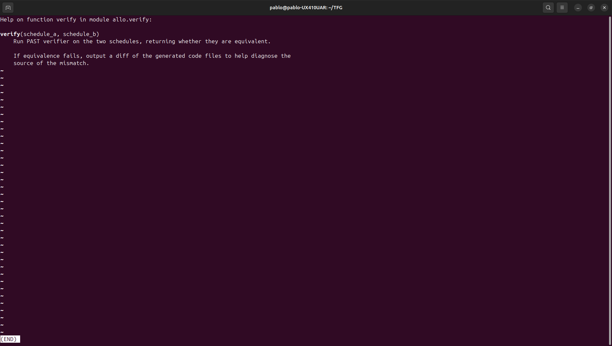

`run_l3_equivalence` se implementó construyendo `s_orig =
allo.customize(kernel_fn)` (sin transformar) y `s =
_construir_schedule(kernel_fn, schedule_src)` (con las primitivas del
Generador), llamando a `allo.verify(s, s_orig)`, con el mismo patrón
defensivo de L1/L2 (`try/except` traduciendo cualquier fallo a `ok=False`).

---

### Parte 2 — Validación en tres niveles (antes de tocar el pipeline real)

Se definió un plan de tres niveles de prueba, cada uno aislando una capa
distinta, para no depurar los tres problemas a la vez si algo fallaba:
(1) `allo.verify()` aislado, (2) el wrapper `run_l3_equivalence` aislado,
(3) `orchestrator.py` completo.

**Nivel 1 — `allo.verify()` aislado (`test_l3_directo.py`).** Dos casos:
mismo kernel comparado consigo mismo (equivalente) y dos kernels con
semántica distinta (no equivalente).

**Bug nº 1:** el Caso A falló con `AssertionError` aunque la comparación
era correcta.

**Figura 2.** `allo.verify()` devuelve `1`, no el booleano `True` de
Python; la aserción original usaba `is True` (identidad, no valor).

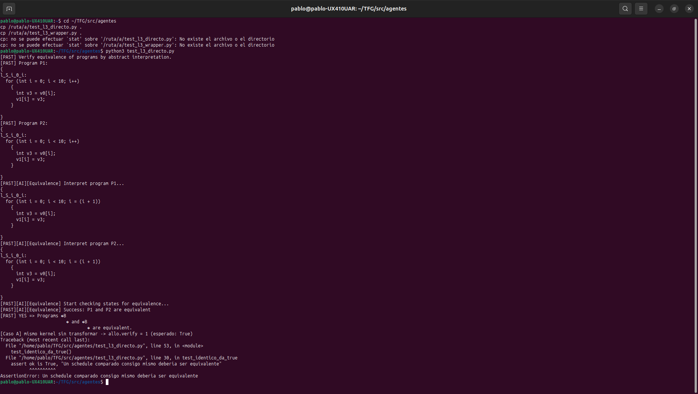

Causa: `1 is True` es `False` en Python. El wrapper real ya usaba
`bool(allo.verify(...))`, así que el bug era solo del script de prueba.
Corregido a `bool(ok) is True`/`False`.

**Nivel 2 — el wrapper aislado (`test_l3_wrapper.py`).**

**Bug nº 2:**

```
TypeError: 'SdkMcpTool' object is not callable
```

**Figura 3.** El decorador `@tool(...)` del SDK envuelve la función en un
objeto `SdkMcpTool`; la función real vive en `.handler`.

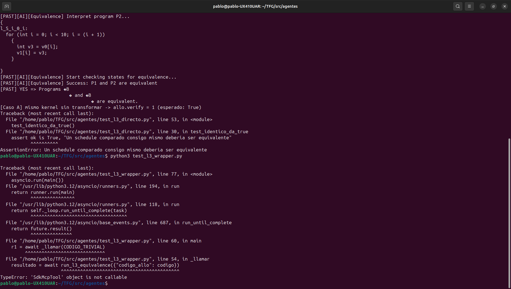

Corregido llamando a `run_l3_equivalence.handler({...})`. Con el fix, dos
casos (schedule trivial y con `s.unroll("i", 2)`) pasaron:

**Figura 4.** `test_l3_directo.py`: Caso A pasando tras el fix.

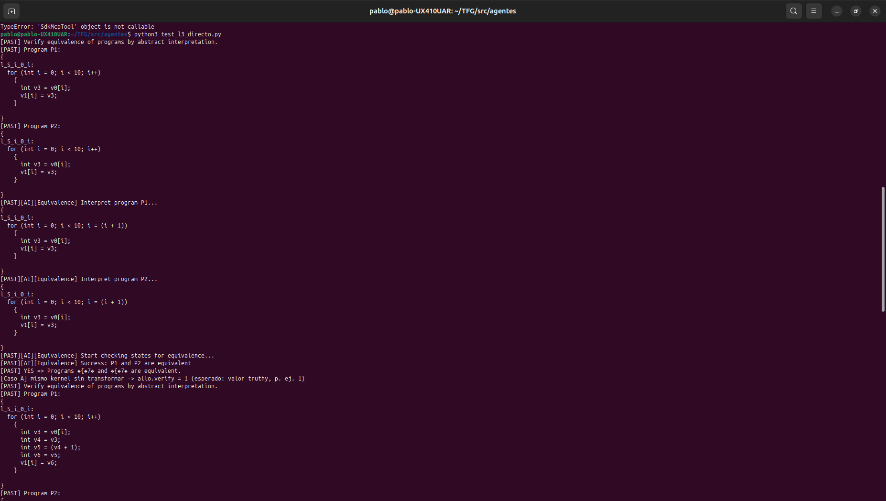

**Figura 5.** El Caso B (no-equivalente) reveló algo no documentado en
`help()`: PAST imprime automáticamente un diff en formato unificado del
código generado al detectar el mismatch.

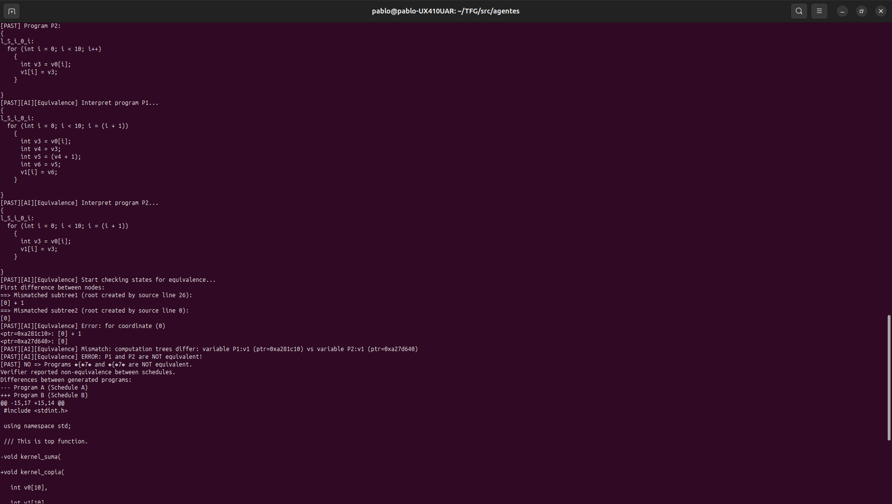

**Figura 6.** Confirmación final de `test_l3_directo.py`: ambos casos
pasan.

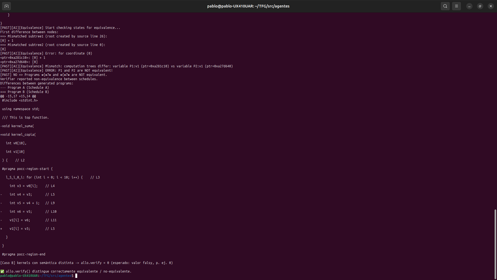

**Figura 7.** `test_l3_wrapper.py`: primer caso (trivial) pasando.

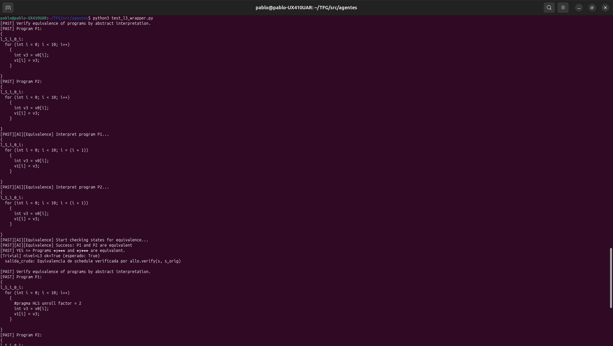

**Figura 8.** Confirmación final: ambos casos (trivial y con `unroll`) dan
`ok=True`.

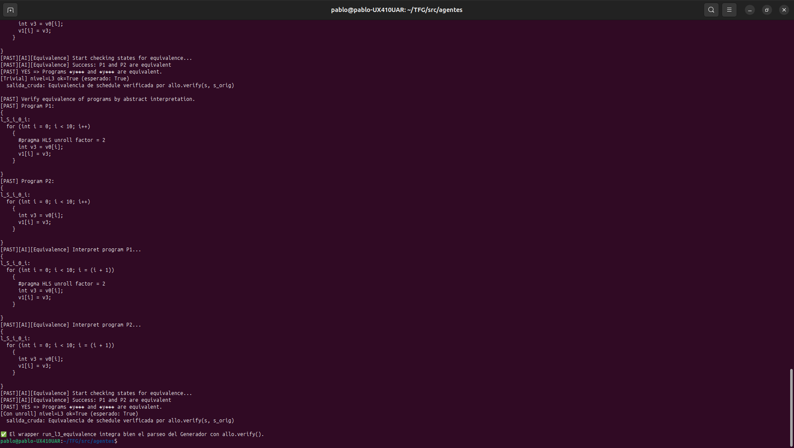

---

### Parte 3 — Mejora: capturar el diagnóstico de PAST en `salida_cruda`

La Figura 5 reveló que PAST imprime su diagnóstico por **stdout durante la
llamada**, no en el valor de retorno. Se envolvió `allo.verify()` con
`contextlib.redirect_stdout()`, adjuntando el log (recortado a ~4000
caracteres) a `salida_cruda` cuando `ok=False`, para que el Validador
tuviera contexto real del mismatch en vez de un `ok=False` mudo.

**Validando la mejora (`test_l3_captura_diff.py`).**

**Bug nº 3 (de diseño de la prueba):** el primer intento comparaba un
kernel "roto" contra **sí mismo**, dando `ok=True` -- resultado correcto,
no un bug del wrapper.

**Figura 9.** `ok=True` cuando se esperaba `False`: el kernel se comparaba
consigo mismo.

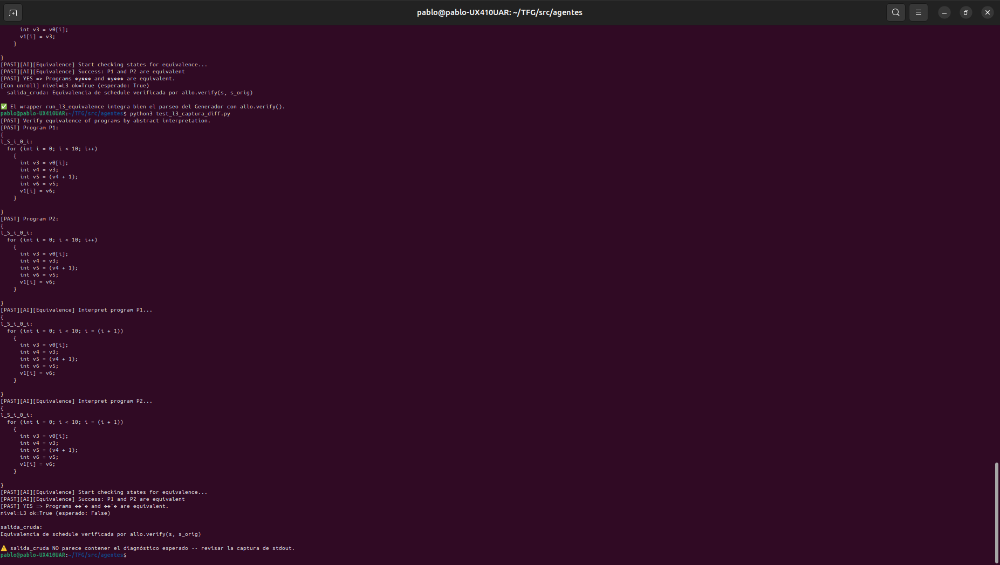

Causa conceptual, importante para la memoria: **L3 protege contra
transformaciones de *schedule* que rompen semántica, no contra que el
*kernel* sea "incorrecto"** respecto a una referencia externa (eso es
responsabilidad exclusiva de L2 contra el golden model).

**Bug nº 4 (técnico):** el segundo intento definía la función "rota"
dentro del string `SCHEDULE` (ejecutado con `exec()` en memoria):

```
OSError: could not get source code
```

**Figura 10.** `allo.customize()` no puede obtener el código fuente de una
función definida vía `exec()` -- la misma restricción ya documentada para
`_cargar_kernel_desde_disco`, pasada por alto en el test.

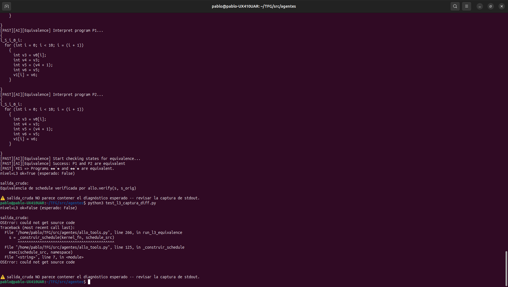

Corregido escribiendo el kernel "roto" a un archivo temporal real e
importándolo con `importlib.util`, igual que hace `_cargar_kernel_desde_disco`.

**Figura 11.** Con el fix: inicio del diagnóstico de PAST capturado.

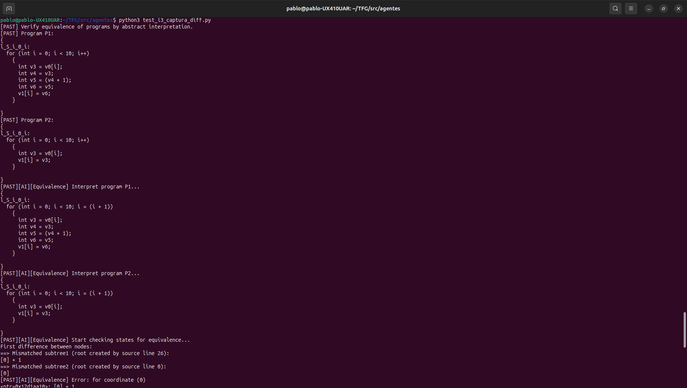

**Figura 12.** Resultado final: `ok=False` con `salida_cruda` conteniendo
el diff completo generado por PAST.

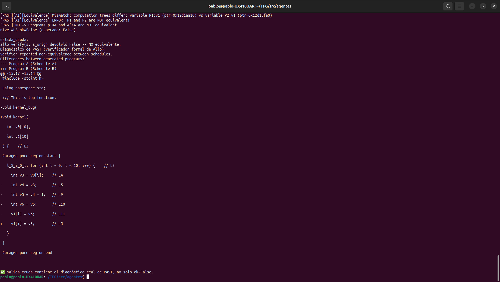

Con esto, L1, L2 y L3 quedaron conectados a Allo real y validados en capas.
Solo faltaba probarlo dentro de `orchestrator.py` -- ahí aparecieron los
bugs más interesantes de toda la sesión.

---

### Parte 4 — Primera corrida real de `orchestrator.py`: bug de Allo (BITREV)

**Iteración 1** de la primera corrida real reveló un fallo genuino y
correctamente manejado: L2 detectó que 31 de 1024 índices excedían la
tolerancia por precisión insuficiente en las constantes de twiddle
codificadas a mano -- la primera vez que el lazo de corrección reacciona a
un error *real* del compilador/simulador, no a un mock. El Validador dio
un diagnóstico correcto con causa raíz identificada.

**Bug nº 5 (real, de Allo, en L1):** en la Iteración 2, un nuevo kernel usaba
una tabla `BITREV` declarada como variable global fuera de la función
`kernel`.

**Figura 13.** `RuntimeError: Unsupported global variable 'BITREV'` --
Allo no soporta referencias a variables globales dentro del kernel.

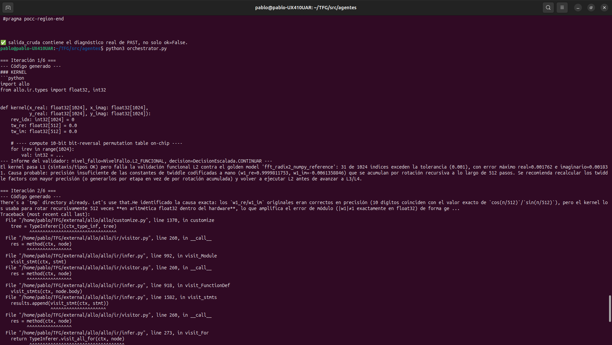

**Figura 14.** Continuación del traceback y el panel de diagnóstico
enriquecido de Allo, con el código fuente resaltado en la línea del error.

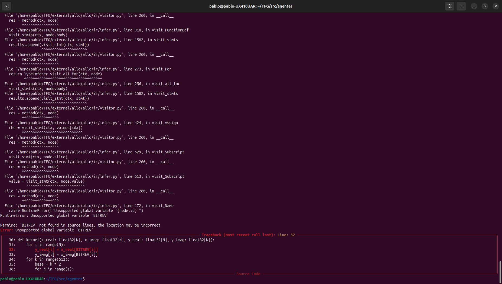

Fix: se añadió una regla explícita a `SYSTEM_PROMPT_GENERADOR` prohibiendo
variables globales/tablas precomputadas fuera de `kernel`, exigiendo que
cualquier tabla se calcule dentro del propio cuerpo de la función.

---

### Parte 5 — El cuelgue silencioso: permisos mal configurados

Tras el fix de BITREV, una corrida se quedó completamente colgada -- sin
traceback, sin volver al prompt, sin poder escribir en la terminal.

**Diagnóstico (sin captura directa, por inspección de código y
documentación del SDK):** a diferencia de `llamar_generador()` y
`llamar_validador()`, `llamar_ejecutor()` no tenía ningún `system_prompt`
propio -- corría con la persona por defecto de Claude Code, restringida
solo en *qué herramientas MCP* podía usar sin pedir permiso, pero sin
prohibirle *intentar* otras (Bash, Read...). Según la documentación del
SDK: una petición de herramienta fuera de `allowed_tools` sin
`permission_mode`/`can_use_tool` configurado cae en un paso de aprobación
que, en un script no interactivo, espera una decisión que nunca llega.

Fix: se añadió `SYSTEM_PROMPT_EJECUTOR` (persona restringida, "ejecutor
mecánico" que solo llama a las 4 herramientas de la cascada) y
`permission_mode="dontAsk"` en los tres agentes -- deniega automáticamente
cualquier petición fuera de `allowed_tools` en vez de esperar.

---

### Parte 6 — `SystemExit` no capturado: el pipeline muere sin traceback

Con el fix de permisos aplicado, una nueva corrida avanzó más lejos (llegó
a L3) pero la terminal volvió al prompt de golpe, sin ningún traceback de
Python visible.

**Figura 15.** `PASTFULLPARSER| Line 145: syntax error, unexpected '=',
expecting ',' or ';'` -- sin traceback de Python alrededor, la terminal
vuelve directamente al prompt tras esta línea.

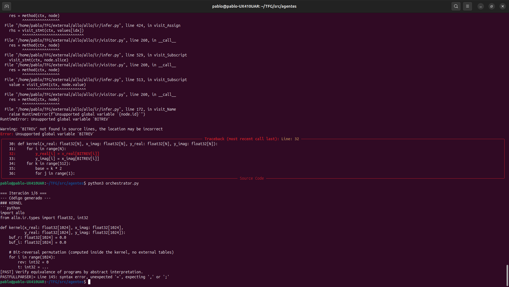

**Bug nº 6 (real, de infraestructura):** se pidió confirmar `echo $?`.

**Figura 16.** Código de salida `1`, sin traceback de Python -- la firma
clásica de un `SystemExit` no capturado.

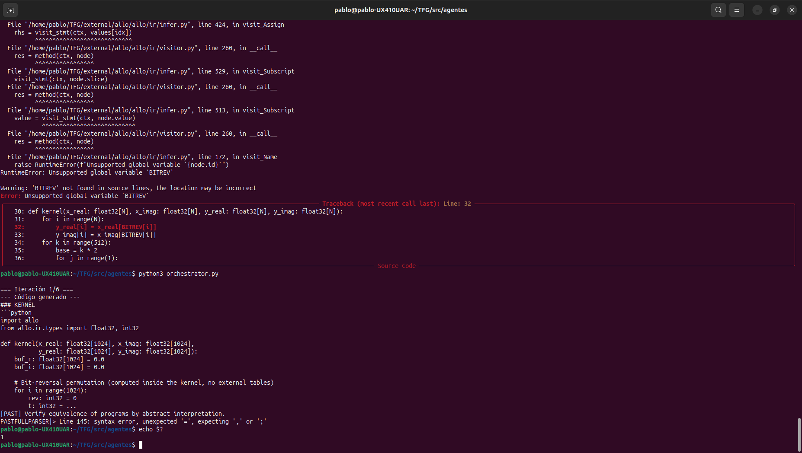

Diagnóstico: `SystemExit` hereda de `BaseException`, no de `Exception`. El
`except Exception as e:` de las tres funciones de la cascada lo deja pasar
de largo, matando todo el proceso. Probablemente PAST, ante un error fatal
de parseo del código C generado, llama internamente a algo como
`sys.exit(1)` en vez de lanzar una excepción Python normal -- y ese
mensaje de PAST se escribe aparentemente a nivel de file descriptor
nativo (C++), no vía `sys.stdout` de Python, por lo que tampoco quedaba
capturado por el `contextlib.redirect_stdout` de la Parte 3.

Fix: nueva constante compartida `ERRORES_CAPTURABLES = (Exception,
SystemExit)`, usada en los `except` de L1, L2 y L3 -- deliberadamente
**sin** capturar `BaseException` a secas, para no absorber también
`KeyboardInterrupt` (Ctrl+C debe seguir pudiendo parar el proceso a mano).

---

### Parte 7 — Un bug de Allo y un bug del SDK, en la misma iteración

La siguiente corrida reveló dos problemas distintos y no relacionados en
la misma iteración.

**Bug nº 7 (real, de la librería Allo):**

**Figura 17.** `TypeError: RuntimeError() takes no keyword arguments` --
Allo intenta construir un `RuntimeError(...)` con argumentos de palabra
clave para reportar una operación binaria no soportada, pero su propio
código de manejo de errores está roto (`RuntimeError()` no acepta kwargs
en Python estándar), enmascarando el mensaje real que quería dar.

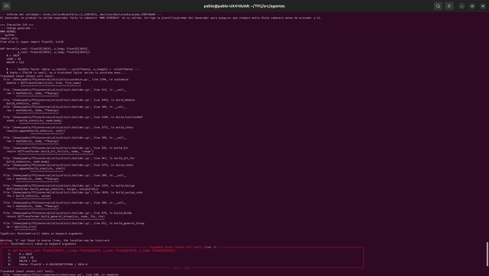

Este `TypeError` sí hereda de `Exception`, así que `ERRORES_CAPTURABLES`
lo capturó correctamente -- sin crash. El problema real apareció justo
después, en la llamada al Validador:

**Bug nº 8 (real, del propio Claude Agent SDK -- issue conocido):**

**Figura 18.** `Exception: Claude Code returned an error result: success`
-- un crash sin relación con Allo, esta vez en `llamar_validador()`, sin
ningún `try/except` de `orchestrator.py` alrededor para contenerlo.

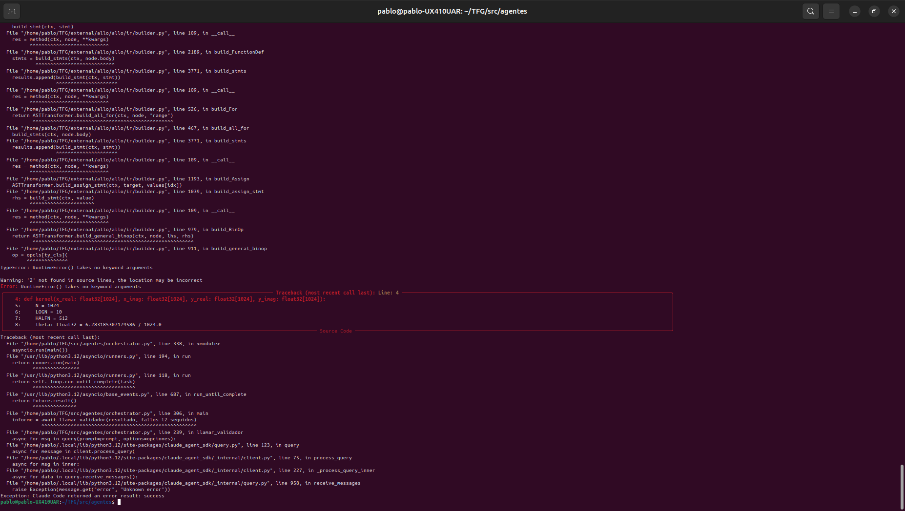

Se localizó el issue exacto en el repositorio del SDK
(`anthropics/claude-agent-sdk-python#1031`): cuando la CLI sale con
`is_error=true` pero `errors` viene vacío, el SDK cae al campo `subtype`
como mensaje de fallback -- que en un cierre "limpio" a nivel de protocolo
vale `"success"`, produciendo el mensaje contradictorio. El mensaje humano
real vive en el campo `result` del JSON, descartado silenciosamente por el
SDK. Causa más probable: un límite de la cuota de la suscripción Pro dado
el volumen de llamadas automatizadas.

Fix: se envolvió `llamar_ejecutor()` + `llamar_validador()` dentro del
bucle de `main()` en un `try/except` que trata cualquier fallo de
infraestructura como transitorio -- se registra, se anota en
`historial_errores`, y se pasa a la siguiente iteración con `continue` en
vez de abortar las `MAX_ITERACIONES` completas.

---

### Parte 8 — Primera corrida sin ningún crash (pero sin converger)

Con los 8 bugs anteriores corregidos, una corrida completó **las 6
iteraciones sin colgarse ni crashear una sola vez** -- confirmación de que
`permission_mode="dontAsk"`, `ERRORES_CAPTURABLES` y el `try/except` del
bucle principal funcionan. No convergió a un kernel validado, pero reveló
un noveno bug real y sistemático, más dos hallazgos de proceso.

**Bug nº 9 (real, de Allo, recurrente -- 3 de 6 iteraciones):**

```
AttributeError: 'Float' object has no attribute '__name__'. 
Did you mean: '__ne__'?
```

**Figura 19.** Iteración 2: el error aparece al procesar un cast inline
`float32(k)` dentro de una expresión aritmética (`TWO_PI * float32(k) /
1024.0`).

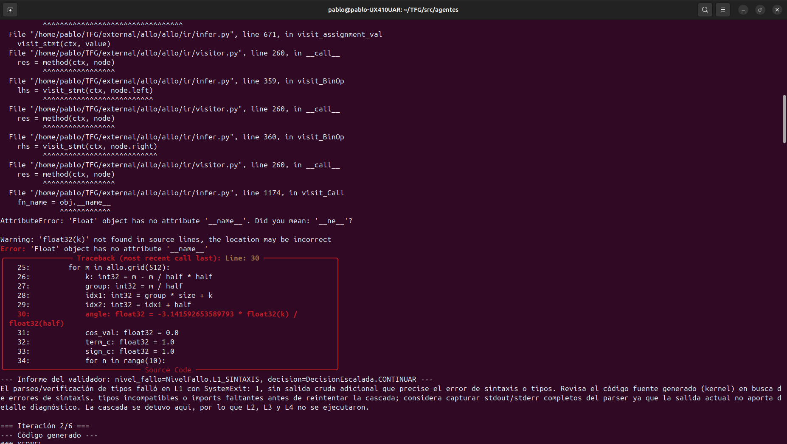

**Figura 20.** Iteración 3: el mismo patrón exacto de error, con otra
variable (`TWO_PI * float32(m) / 1024.0`).

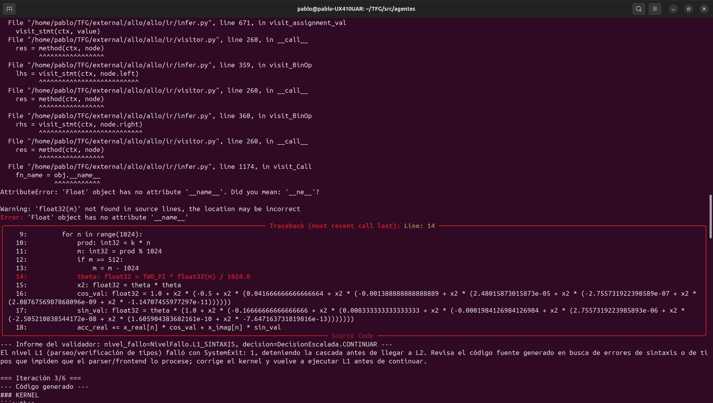

**Figura 21.** Iteración 5: tercera repetición del mismo patrón
(`TWOPI * float32(idx) / 1024.0`).

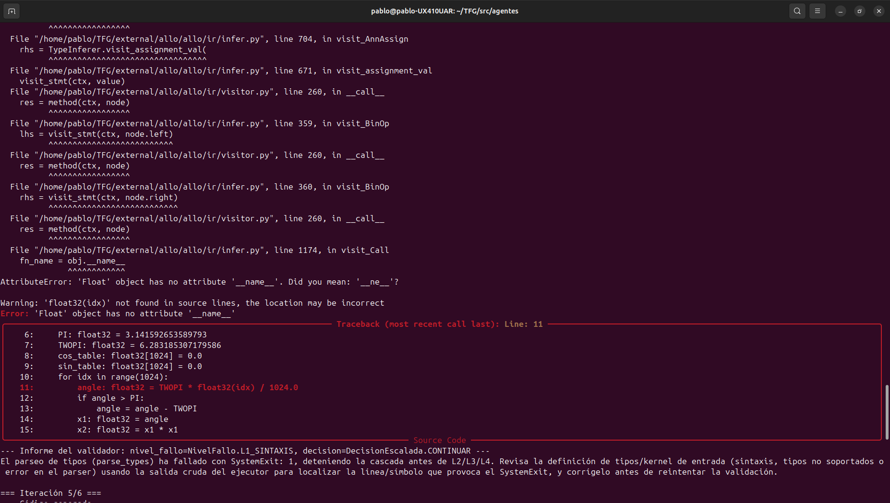

El inferenciador de tipos de Allo (`infer.py`, `visit_Call`) no maneja
bien un cast de tipo usado como llamada inline dentro de una expresión
aritmética -- no es casualidad aislada, es un patrón sistemático del
Generador chocando con una limitación real de Allo, repetido con kernels
distintos.

**Hallazgo de proceso, señalado por el propio Validador:** su mensaje pedía
explícitamente *"considera capturar stdout/stderr completos del parser ya
que la salida actual no aporta detalle diagnóstico"* -- la captura de
stdout de la Parte 3 solo se había aplicado a L3, no a L1/L2, así que estos
`SystemExit` llegaban al Validador como un `SystemExit: 1` mudo.

**Figura 22.** Iteración 6 (última del presupuesto): el Generador volvió a
omitir la cabecera `### SCHEDULE` -- el mismo error de las Iteraciones 1 y
6 de corridas anteriores, agotando el presupuesto de 6 iteraciones sin
converger.

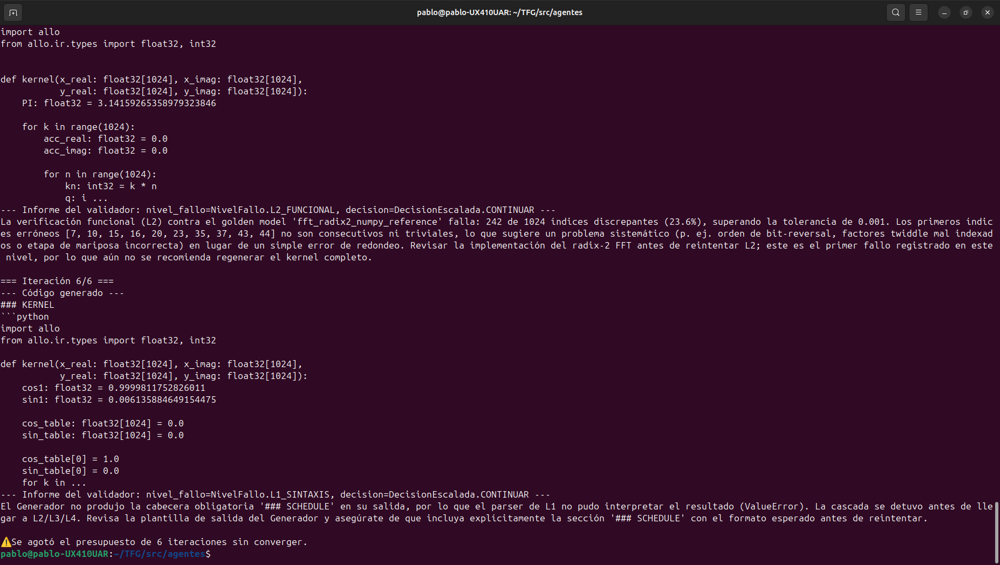

**Tres fixes aplicados tras esta corrida:**

1. Nueva regla en `SYSTEM_PROMPT_GENERADOR` prohibiendo casts inline
   (`float32(k)` dentro de una expresión), con ejemplo MAL/BIEN explícito:
   asignar primero a una variable tipada, usarla después.
2. Nuevo helper `_formatear_error()` en `allo_tools.py` + captura de stdout
   con `contextlib.redirect_stdout` generalizada a L1 (`allo.customize()`)
   y L2 (`_construir_schedule`/`s.build()`), no solo L3. Cuando el error es
   `SystemExit`, deja explícito si el log de Python capturó algo o si Allo
   probablemente escribió a nivel de file descriptor nativo.
3. `llamar_generador()` ahora valida localmente que la respuesta traiga
   ambas cabeceras (`### KERNEL` y `### SCHEDULE`) antes de pasarla al
   Ejecutor -- si falta alguna, un único reintento automático con un
   recordatorio explícito, más barato que descubrirlo tres pasos después.

---

### Parte 9 — Primera convergencia completa

Con los tres fixes de la Parte 8 aplicados, la siguiente corrida produjo el
primer kernel que pasa **las cuatro barreras de la cascada** y queda
persistido en el catálogo. A continuación, una explicación figura a figura
de qué construye el kernel ganador y qué está verificando PAST en cada
paso.

**Figura 23.** Cálculo de las constantes de twiddle mediante una serie de
Taylor manual para coseno y seno, usando variables tipadas intermedias
(`k_f`, `n_f`, `theta`, `cos_term`, `cos_sum`...) en vez de casts inline --
exactamente el patrón "BIEN" añadido al prompt en la Parte 8. `PAST`
empieza a interpretar el "Programa P1" (el schedule *sin* transformar,
`s_orig`) para la comparación de equivalencia de L3.

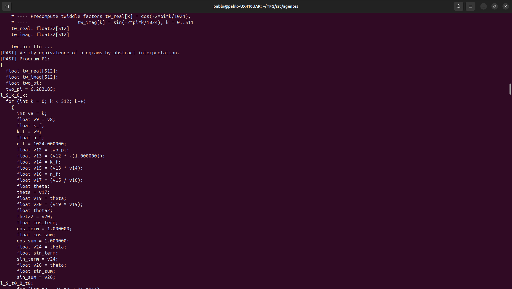

**Figura 24.** Continuación del cálculo de la serie de Taylor: los
términos sucesivos de la serie (`v34`...`v70`) acumulándose en `cos_sum` /
`sin_sum` mediante la recurrencia término a término, hasta escribir el
resultado final en `tw_real[k]` / `tw_imag[k]`.

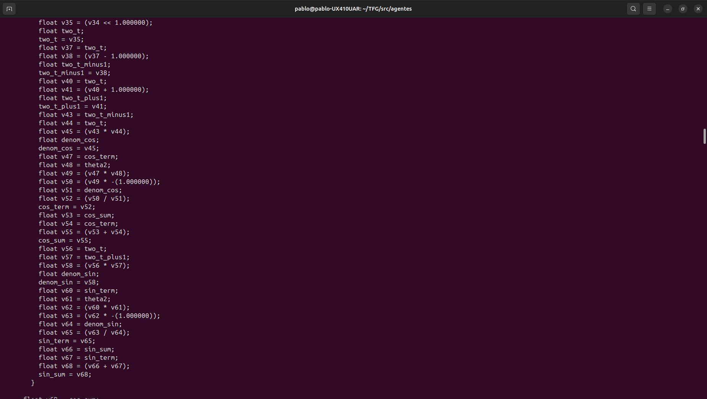

**Figura 25.** La permutación bit-reversal: por cada índice `i` de 0 a
1023, invierte sus 10 bits (`b` de 0 a 9) mediante desplazamientos (`<<`)
y acumulación en `rev`, para reordenar las muestras de entrada antes de la
mariposa iterativa -- el paso clásico de preparación de una FFT
Cooley-Tukey decimada en tiempo (DIT).

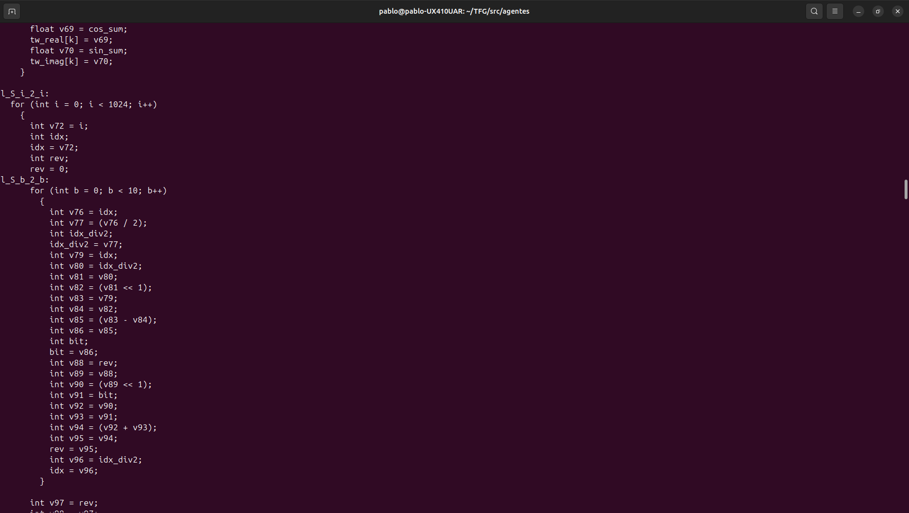

**Figura 26.** El núcleo de la mariposa Cooley-Tukey iterativa: para cada
etapa `s` (0 a 9), duplica el tamaño de grupo `m`, recorre los
`num_groups` grupos y, dentro de cada uno, combina pares de índices
(`idx1`, `idx2`) separados por `half` usando el factor de twiddle
correspondiente (`tw_index = j * step`) -- la estructura estándar de una
FFT radix-2 in-place.

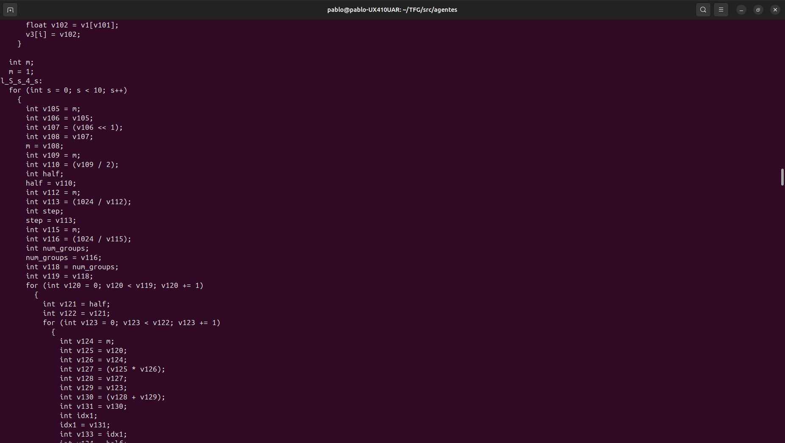

**Figura 27.** `[PAST] Program P2`: PAST reconstruye el "Programa P2" (el
schedule real, aunque en este caso trivial -- ver nota más abajo) a partir
del código C generado, como paso previo a la interpretación simbólica.

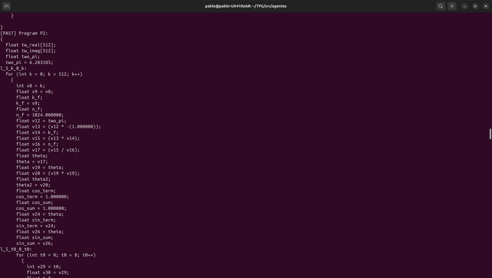

**Figura 28.** `[PAST][AI][Equivalence] Interpret program P1...`: PAST
empieza la interpretación abstracta del Programa P1 (constantes
sustituidas por marcadores simbólicos `_past_fp_value_...` para el análisis
de equivalencia).

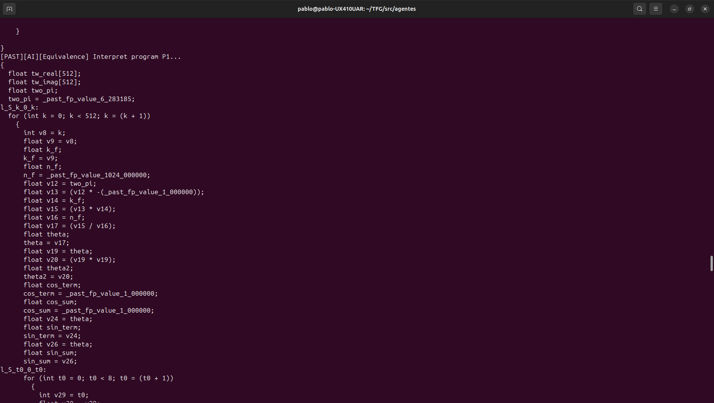

**Figura 29.** `[PAST][AI][Equivalence] Interpret program P2...`: mismo
proceso para el Programa P2. Como el `SCHEDULE` de este kernel es trivial
(`s = allo.customize(kernel)`, sin primitivas), P1 y P2 son estructuralmente
casi idénticos -- la equivalencia era, en este caso concreto, la más
sencilla de verificar posible.

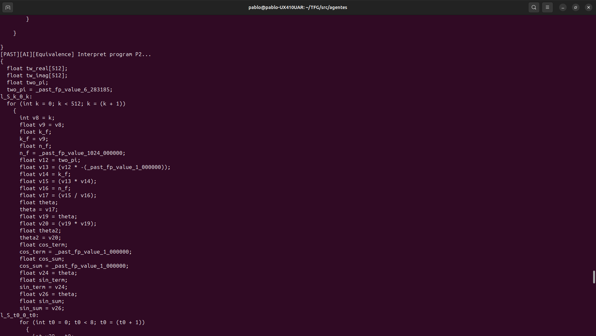

**Figura 30.** Resultado final: `[PAST][AI][Equivalence] Success: P1 and P2
are equivalent`, y el informe completo del Validador confirmando que L1,
L2, L3 y L4 (mock) pasaron, con el kernel guardado en
`results/catalogo/fft_radix2.json`.

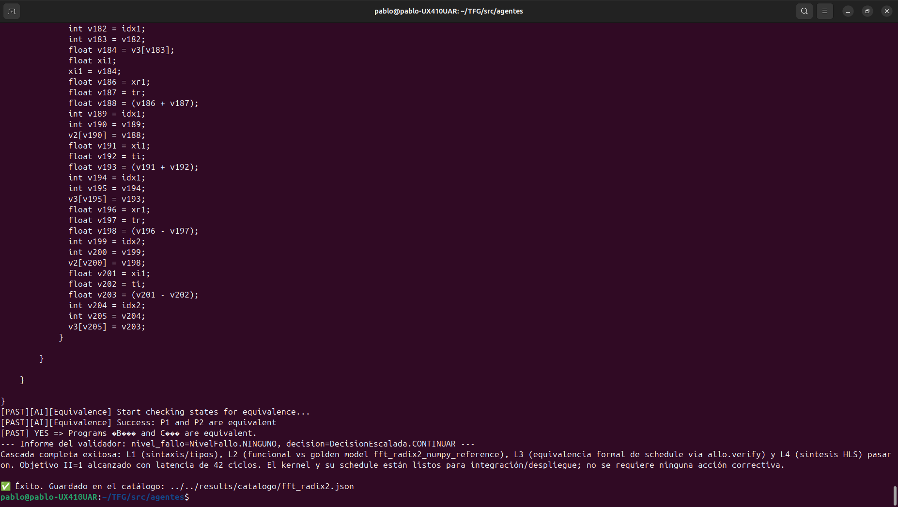

---

### Aviso importante: qué parte de este éxito es real y qué parte es mock

**L1, L2 y L3 son un resultado genuino y verificado contra Allo real** --
el kernel es una FFT radix-2 Cooley-Tukey completa (permutación
bit-reversal + mariposa iterativa + twiddle factors por serie de Taylor),
pasó L2 contra el golden model de NumPy de verdad, y L3 verificó
formalmente con PAST que el schedule (trivial, en este caso) preserva la
semántica del kernel.

**L4 sigue siendo el mock.** El `II=1` y la `latencia de 42 ciclos` que
aparecen en el informe final son los valores hardcodeados de
`run_l4_hls` (`ii_conseguido = objetivo_ii # MOCK`), no una síntesis HLS
real contra Vitis. Además, como el `SCHEDULE` de este kernel es trivial
(sin ninguna primitiva de Allo aplicada), es muy probable que este mismo
kernel **no** alcance `II=1` en una síntesis real sin añadir pipelining al
bucle interno de la mariposa -- buen primer caso de prueba para cuando se
implemente L4 de verdad.

### Estado de la cascada L1–L4 al cierre de esta entrada

| Nivel | Estado |
|---|---|
| L1 — sintaxis/tipos | Conectado a Allo real, validado en capas y en pipeline completo |
| L2 — funcional (golden model) | Conectado a Allo real, validado en capas y en pipeline completo |
| L3 — equivalencia formal de schedule | Conectado a Allo real, validado en capas y en pipeline completo (9 bugs encontrados y corregidos en el proceso) |
| L4 — síntesis HLS | Todavía mockeado -- pendiente de implementación real |

### Aprendizajes para la memoria del TFG

- De los 9 bugs encontrados en esta fase, se reparten en tres categorías
  claramente distintas, útil para la sección de metodología de la memoria:
  **bugs del propio código del proyecto** (comparación `is True` en vez de
  `bool()`, llamada directa a `SdkMcpTool` en vez de `.handler`, diseño de
  test con `exec()` en memoria), **bugs/limitaciones reales de Allo**
  (variables globales no soportadas, `RuntimeError()` con kwargs roto,
  `AttributeError` en el inferenciador de tipos con casts inline,
  `SystemExit` en vez de excepciones Python normales ante errores fatales
  de PAST), y **un bug del propio Claude Agent SDK** (mensaje de error
  engañoso ante fallos de API, issue #1031 ya reportado).
- La metodología de validación en capas (directo → wrapper aislado →
  pipeline completo) permitió aislar cada fallo a su capa correcta en vez
  de mezclar diagnósticos -- especialmente valioso cuando el mismo síntoma
  (`SystemExit`, un crash sin traceback) podía venir de fuentes tan
  distintas como Allo o el SDK.
- Distinción de arquitectura importante: L3 no valida que el kernel sea
  "correcto" -- valida que las transformaciones del *schedule* preserven
  lo que el kernel *ya* calcula. La corrección del kernel frente a una
  referencia es responsabilidad exclusiva de L2.
- `SystemExit` hereda de `BaseException`, no de `Exception`: cualquier
  `except Exception` en un proyecto que envuelva herramientas externas con
  manejo de errores propio (como Allo/PAST) debe considerar explícitamente
  si esa herramienta puede llamar a `sys.exit()` internamente.
- Un resultado de "éxito" en el informe del Validador no es
  automáticamente evidencia completa si parte de la cascada sigue
  mockeada -- important dejarlo explícito en cualquier documento que cite
  este resultado, para no sobrerrepresentar el alcance real del sistema en
  este punto del desarrollo.

### Pendiente para la siguiente sesión

- Implementar L4 real (`s.build(target="vitis_hls", mode="csyn")`),
  reutilizando `ERRORES_CAPTURABLES` y el patrón de captura de stdout ya
  validado en L1-L3.
- Confirmar si el kernel de `fft_radix2.json` alcanza `II=1` con una
  síntesis real, o si hace falta añadir pipelining al bucle interno de la
  mariposa.
- Revisar si el bug del SDK (issue #1031) está corregido en versiones más
  recientes de `claude-agent-sdk-python`.

---

## L4 real: instalación de Vitis HLS y primera síntesis genuina

**Contexto.** Con L1-L3 conectados a Allo real, se aborda la pieza que
faltaba: L4 (síntesis HLS), que seguía devolviendo los números fijos del
mock. Antes de escribir código, primera duda a resolver: ¿hace falta
licencia de pago de Xilinx/AMD para esto?

**Descubrimiento clave: la síntesis C (`csyn`) no requiere licencia.**
Solo hace falta licencia de Vivado si se quiere llegar a implementación de
RTL/bitstream — fuera del alcance de este TFG. Esto despeja el camino para
instalar Vitis HLS sin coste.

**Decisión de versión: Vitis HLS 2023.1, no la última.** El propio paper
de Allo (PLDI'24) y su artifact de reproducción usan 2022.1 con el flujo
"classic" (`vitis_hls` + `run.tcl`). Desde 2023.1+ AMD migra hacia el
nuevo Vitis Unified IDE y el modo classic empieza a deprecarse. Se
descarta 2022.1 (solo soporte oficial hasta Ubuntu 20.04; el equipo de
desarrollo corre Ubuntu 24.04.4 LTS) y se elige 2023.1 como compromiso:
primera versión con soporte oficial de 22.04+ que conserva el flujo
classic accesible.

**Instalación:** documentada en detalle aparte, en `docs/SETUP_VITIS.md`
(dependencias `libtinfo5`/`libncurses5`/`libncursesw5` retiradas de los
repos de Ubuntu 22.04+, resueltas mezclando paquetes de Launchpad y de
Debian con cuidado de mantener todas en la misma versión exacta;
instalador gráfico de Xilinx; bache del locale `en_US.UTF-8` no generado
por defecto en instalaciones en español). Ver ese documento para el
procedimiento completo si hay que reproducir el entorno en otra máquina.

**Bug real: el binario `vivado_hls` está discontinuado desde Vitis
2020.2+.** El target legacy `"vivado_hls"` de Allo (el único que soporta
`mode="csyn"` con métricas completas) genera un Makefile que invoca
literalmente un binario llamado `vivado_hls` — que ya no existe en
instalaciones modernas de Vitis (se llama `vitis_hls`, con una estructura
interna de directorios distinta). Un symlink `vivado_hls -> vitis_hls`
hace que Allo *detecte* la herramienta (pasa la comprobación
`is_available()` en `s.build()`), pero al ejecutarse revienta:

```
ERROR: Could not find 64-bit executable.
ERROR: .../bin/unwrapped/lnx64.o/vivado_hls does not exist
```

`vitis_hls`, al ser invocado bajo el nombre `vivado_hls` (dispatch por
`argv[0]`), intenta localizar un ejecutable "unwrapped" en una subcarpeta
que existía en la estructura antigua de Vivado HLS pero que ya no existe
en el árbol de instalación de Vitis 2023.1.

**Solución adoptada:** dejar que `s.build(target="vivado_hls",
mode="csyn", project=...)` genere el proyecto en disco (esto **no**
requiere `vivado_hls`/`vitis_hls` todavía -- solo escribe archivos), y
**no llamar a `mod()`** (que es lo que dispara el Makefile roto). En su
lugar, se invoca `vitis_hls -f run.tcl` directamente por subprocess,
saltándose el Makefile de Allo por completo. Confirmado a mano en
terminal antes de integrarlo: la síntesis corre limpia y genera el informe
real (`II=1`, latencia 34 ciclos, 0 BRAM/DSP, 106 LUT, 15 FF, Fmax 438.98
MHz para un kernel de prueba trivial de suma de vectores).

**Hallazgo de estructura del proyecto:** el proyecto real de Vitis queda
anidado en `<project_dir>/out.prj/` -- Allo usa ese nombre fijo
internamente sin importar qué se pase en `project=`. El informe de
síntesis vive en
`<project_dir>/out.prj/solution1/syn/report/kernel_csynth.xml`.

**`run_l4_hls` real, integrado en `allo_tools.py`:**
1. `_extraer_bloques` + `_cargar_kernel_desde_disco` + `_construir_schedule`
   (mismas utilidades ya usadas en L1-L3).
2. `s.build(target="vivado_hls", mode="csyn", project=<tmp dir>)`.
3. `subprocess.run(["vitis_hls", "-f", "run.tcl"], cwd=<tmp dir>, timeout=...)`.
4. Parseo del XML con `xml.etree.ElementTree`, extrayendo:
   `PipelineII` (mínimo de todos los bucles bajo `SummaryOfLoopLatency`),
   `Worst-caseLatency`, `EstimatedClockPeriod`, y recursos
   (`BRAM_18K`/`DSP`/`LUT`/`FF`).

**Primera corrida real completa del pipeline con L4 real** (FFT completa,
no el kernel de prueba): llegó hasta L4 con métricas genuinas
(`latencia_peor_caso=72865 ciclos`, `periodo_reloj≈4.669 ns`) — primera
vez que el lazo se cierra de principio a fin contra hardware real. No
convergió a la primera (falló el objetivo `II=1`), pero es la prueba de
concepto real que hacía falta para la memoria.

---

## Robustecer la infraestructura: tres bugs de aislamiento de procesos

Tras la primera corrida con L4 real, aparecieron tres clases de fallo de
infraestructura completamente distintas al contenido generado por el LLM
-- merece la pena documentarlas por separado porque cada una es un
patrón general reutilizable, no un detalle de esta FFT en concreto.

### 1. El issue #1031 del SDK también salta dentro de `llamar_generador()`

El `try/except` que envolvía el bug conocido del SDK (mensaje engañoso
"Claude Code returned an error result: success" ante fallos de API, ver
entrada del 6 de agosto) solo cubría `llamar_ejecutor`/`llamar_validador`.
Al saltar dentro de `llamar_generador()` en una corrida real, tumbó todo
el proceso sin control. **Fix:** las tres llamadas de la iteración
(Generador, Ejecutor, Validador) viven ahora dentro del mismo bloque
`try/except`, tratando un fallo de infraestructura en cualquiera de las
tres como transitorio.

### 2. Crash nativo (SIGABRT) del verificador PAST

El parser de PAST tiene reglas gramaticales sin implementar
(`[PAST][Parser] Rule 7 not implemented!`) que, con ciertos kernels, no
solo producen un árbol incompleto sino que disparan un `assert()` de C++
real:

```
core/past.c:2489: set_parent_pref: Assertion `n->rhs' failed.
```

Esto termina en `abort()` -- `SIGABRT` mata el proceso Python **entero**,
algo que ningún `except Exception`/`except SystemExit` puede capturar (no
es una excepción de Python en absoluto). Esto explica retroactivamente
algunos "cuelgues" inexplicados de sesiones anteriores.

**Solución: aislar `allo.verify()` en un subproceso separado**
(`l3_subproceso.py`, nuevo archivo). `run_l3_equivalence` en
`allo_tools.py` ya no llama a `allo.verify()` directamente -- lanza el
subproceso vía `subprocess.run()` y comprueba el `returncode`: si es
negativo (terminado por señal, p.ej. `-6` = SIGABRT en la convención de
Python, o `134` en la convención de exit code de bash), lo reporta como
fallo L3 controlado sin que el proceso principal muera. Confirmado
empíricamente: el mismo crash de PAST ocurre dentro del subproceso, pero
`orchestrator.py` sigue vivo después.

**Efecto colateral encontrado y corregido:** al capturar
`stdout`/`stderr` del subproceso con `text=True`, el panel de diagnóstico
nativo de PAST a veces escribe bytes que no son UTF-8 válido, y
`subprocess.run()` lanzaba `UnicodeDecodeError` directamente. Se cambió a
capturar en bytes y decodificar con `errors="replace"`.

**Segundo efecto colateral, más sutil:** incluso decodificando bien, el
panel nativo de PAST podía mezclarse con el `print(json.dumps(...))` de
Python en el mismo stream, corrompiendo el JSON aunque la verificación
hubiera tenido éxito de verdad (`[PAST][AI][Equivalence] Success` visible
en el log crudo, pero `json.loads()` fallando igualmente). **Solución
definitiva:** `l3_subproceso.py` ya no imprime el resultado por stdout --
lo escribe a un **archivo dedicado** cuya ruta se pasa como argumento, y
`run_l3_equivalence` lee ese archivo directamente, completamente aislado
de cualquier ruido en stdout/stderr.

### 3. Vallas de markdown sueltas en el `.py` escrito a disco

`_extraer_bloques()`/`_limpiar()` solo comprobaba la primera y última
línea del bloque en busca de fences ` ``` `. Un caso real: el Generador
dejó una valla suelta en medio del texto, que no se eliminó y rompió la
sintaxis del `.py` guardado en disco (fallo en L1). **Fix:** se sustituyó
por una limpieza basada en regex que elimina **cualquier línea** que sea
puramente una valla de markdown (con o sin especificador de lenguaje),
esté donde esté en el bloque.

---

## El candado del kernel no era un candado de verdad

**Bug de arquitectura, no de Allo ni del SDK.** Cuando el Validador
decidía `SOLO_TOCAR_SCHEDULE`, `orchestrator.py` solo le decía al
Generador **en texto** "el kernel es correcto, no lo toques" -- pero sin
pasarle el código real, el modelo simplemente escribía un kernel nuevo
desde cero en cada intento (confirmado comparando los `debug_iteraciones/
*.txt` de intentos consecutivos: usaban algoritmos distintos -- DFT
directa O(N²) en uno, mariposas radix-2 en otro). El "candado" no
restringía nada de verdad.

**Fix:** cuando la decisión es `SOLO_TOCAR_SCHEDULE`, se extrae el bloque
`### KERNEL` real de esa iteración (con `_extraer_bloques`, la misma
utilidad de `allo_tools.py`) y se reenvía **literalmente** en el siguiente
prompt del Generador, con instrucciones explícitas de copiarlo carácter
por carácter y limitarse a escribir un `### SCHEDULE` nuevo. El estado es
"pegajoso": si un ajuste de schedule rompe algo en L1/L2 en vez de fallar
limpiamente en L4, se sigue reutilizando el mismo kernel verificado en vez
de perderlo.

## Presupuestos de iteración separados: generar kernel vs. ajustar schedule

**Problema observado:** con el candado ya arreglado, cada ajuste de
schedule seguía consumiendo una de las `MAX_ITERACIONES` totales, igual
que una regeneración completa de kernel -- pero afinar `pipeline`/
`partition` sobre un diseño ya verificado en L1-L3 es mucho más barato y
necesita más intentos que generar un kernel desde cero.

**Fix:** `main()` se reescribió como un `while True` con dos contadores
independientes:
- `MAX_ITERACIONES = 6` -- generación completa de kernel+schedule.
- `MAX_INTENTOS_SCHEDULE = 8` -- ajustes de schedule sobre un kernel ya
  congelado.
- `MAX_ITERACIONES_TOTAL = 25` -- tope de seguridad absoluto combinado.

Cada tipo de intento se imprime diferenciado (`=== Iteración de kernel
N/6 ===` vs. `=== Intento de ajuste de schedule M/8 (kernel congelado)
===`). Si se agotan los 8 intentos de schedule sin cerrar el II, el propio
orquestador decide regenerar el kernel desde cero automáticamente. Los
archivos de depuración pasaron a numerarse por intento global
(`debug_iteraciones/intento_N.txt`) en vez de por iteración, para no
perder la traza al mezclar los dos contadores.

**De paso:** se añadió el guardado del código **completo** generado en
cada intento a ese archivo -- el `print(codigo[:400], ...)` que había
hasta entonces solo mostraba el bloque `KERNEL` (más largo que el
`SCHEDULE`), así que el `SCHEDULE` -- justo donde ocurrían la mayoría de
los bugs recientes -- nunca llegaba a verse ni en pantalla ni en el log.

## Timeout de síntesis L4: una subida progresiva basada en evidencia

300s (valor inicial) resultó insuficiente casi de inmediato con la FFT
completa (frente al kernel trivial de prueba). Subido a 600s, y más
adelante a 1200s tras confirmar que 600s seguían sin bastar en el
hardware disponible (portátil de gama media) para cerrar síntesis con
`objetivo_ii=1`. Nota para la memoria: cada subida se documentó con el
razonamiento en el propio comentario de la constante en
`allo_tools.py`, no solo aquí.

**Aviso importante detectado en paralelo:** una racha de 5 fallos
idénticos y consecutivos del issue #1031 del SDK, justo después de
encadenar tres síntesis reales de 20 minutos cada una, resultó ser
**agotamiento de la cuota de la suscripción Pro**, no un bug -- confirma
empíricamente la sospecha que ya se había dejado apuntada en la decisión
#6 de `arquitectura.md` el 28 de julio. Lección práctica: si el issue
#1031 aparece de forma repetida y consecutiva tras una sesión larga de
uso intensivo, sospechar primero de la cuota antes de seguir depurando
código.

---

## Tres bugs reales de la API de Allo, encontrados por ensayo empírico

Igual que con `vivado_hls`/`vitis_hls`, la documentación pública y el
`help()` de Allo no bastaron por sí solos -- hizo falta reproducir cada
fallo de forma aislada y leer tracebacks/código fuente de Allo para
encontrar la causa real. Tres casos, cada uno cronológicamente posterior
al anterior:

### 1. El formato real de `target` en `s.partition()`

`help(s.partition)` documentaba `target: allo.ir.utils.MockBuffer | str`
pero no detallaba el formato exacto del string. El Generador escribía
`s.partition("x_real", ...)`, fallando repetidamente con:

```
ValueError: not enough values to unpack (expected 2, got 1)
```

Reproducido en aislado, el traceback completo señaló la causa real dentro
del propio código de Allo:

```python
# allo/customize.py:308, dentro de partition()
func_name, buf_name = target.split(":")
```

El string de `target` debe tener el formato `"nombre_funcion:nombre_array"`
-- como el kernel se llama siempre `kernel`, en la práctica esto es
siempre `"kernel:nombre_array"`. Confirmado con una prueba positiva
(`s.partition("kernel:x_real", ...)` funciona). Añadido al prompt con un
ejemplo explícito y la advertencia de que el formato sin prefijo "NUNCA"
debe usarse.

### 2. Recurrencia secuencial en el cálculo de tablas de twiddle

Con un kernel ya congelado, 5 intentos de schedule consecutivos fallaron
con `II=null` pese a variar las directivas de pipeline/partition sin
éxito. El kernel en cuestión calculaba la tabla de twiddles así:

```python
for tw_j in range(1, half):
    prev_r: float32 = tw_real[tw_j - 1]   # <- depende del resultado anterior
    tw_real[tw_j] = prev_r * wr_step - prev_i * wi_step
```

Una recurrencia real (`tabla[k] = f(tabla[k-1])`) crea una dependencia
secuencial genuina que **ningún** pragma de `pipeline`/`partition` puede
romper, porque no es una limitación de recursos sino del propio cálculo.
Ningún ajuste de schedule iba a arreglar esto -- hacía falta cambiar el
**kernel**. Solución: calcular cada elemento de la tabla de forma
independiente a partir de su índice (`angle = ANGULO_BASE * k`, con la
misma serie de Taylor de siempre), sin encadenar al elemento anterior.
Añadida como regla explícita y prohibición en el prompt, con ejemplo
MAL/BIEN.

### 3. Bucles exteriores con bounds dependientes de la variable de bucle

Otro patrón distinto de `II=null` (y una `latencia_peor_caso` con un
número absurdo, del orden de 10^14 ciclos -- confirmado como un valor
centinela real de Vitis cuando no puede determinar un trip count, no un
dato de hardware genuino): un bucle exterior de pocas iteraciones (`for
stage in range(10)`) cuyo cuerpo define `half`/`num_groups` que acotan
los bucles internos. Sin desenrollar `stage`, esos límites son variables
en tiempo de ejecución en el C++ generado, y HLS no puede acotar el trip
count de los bucles internos.

**Primer intento de solución (fallido de forma intermitente):**
`s.unroll("stage", factor=0)` en el `SCHEDULE`. Aunque el nombre de la
variable coincidía exactamente con el del kernel, esto falló en más de
una generación distinta con un crash real del compilador de Allo:

```
error: Cannot find Stage S_stage_2
error: failed to legalize operation 'allo.unroll'
error: cannot be converted to LLVM IR: missing LLVMTranslationDialectInterface...
```

Al repetirse con nombres de variable distintos (`stage`, `s`) en
generaciones completamente independientes, se descarta que sea un
problema de nombrado -- es una fragilidad real de cómo Allo genera
identificadores internos de "Stage" en MLIR para `unroll()` sobre este
tipo de bucle, no depurable sin tocar el código fuente de Allo.

**Solución adoptada, más robusta:** prohibir `s.unroll()` sobre este
patrón por completo y exigir el desenrollado **manual, en el propio
código del KERNEL** -- escribir las 10 iteraciones como 10 bloques de
Python literales y separados, con `half`/`num_groups`/etc. ya como
constantes fijas en cada bloque (patrón que las corridas de convergencia
real de mediados de agosto ya usaban con éxito, con `allo.grid(p0, q0)`
por etapa). Es más código para el Generador, pero no depende en absoluto
de la API de scheduling de Allo que ha demostrado ser frágil en este
punto concreto.

### Consecuencia sobre partición: `Complete` en vez de `Cyclic`/`Block` para arrays de stride variable

Con el bucle de etapas desenrollado (manual o vía `unroll`, cuando
funcionaba), cada copia desenrollada tiene un `half` distinto (1, 2,
4...512), así que el patrón de acceso a `y_real`/`y_imag` cambia de
"stride" en cada etapa. Un único `Partition.Cyclic`/`Block` con factor
fijo no puede garantizar accesos libres de conflicto de banco para 10
patrones de stride distintos a la vez -- 7 intentos de schedule
consecutivos oscilaron entre timeout e `II=null` variando ese factor sin
éxito. **Solución:** usar `Partition.Complete` en los arrays afectados por
este patrón -- más caro en recursos (registros en vez de BRAM), pero
elimina la ambigüedad de conflicto de banco sin importar el patrón de
índices; para arrays de 1024 elementos float32 cabe sobradamente dentro
de los recursos disponibles de la FPGA objetivo (UltraScale+, según los
informes de síntesis ya vistos).

---

## Housekeeping de git: artefactos de Vitis colados en el repositorio

**Problema.** Un `git add . && git commit` capturó por descuido el
proyecto completo de un test aislado de Vitis HLS
(`src/agentes/test_l4.prj/`, con cientos de archivos binarios internos de
`.autopilot` -- `.bc`, RTL generado, logs de compilador), varios
`salida_*.log` de corridas del orquestador, y los scripts de inspección
puntual (`inspeccionar_*.py`, `reproducir_fallo_partition.py`) que ya
habían cumplido su función diagnóstica. Nada de esto debería versionarse.

**Solución:**
```bash
git rm -r --cached src/agentes/test_l4.prj
git rm -r --cached src/agentes/debug_iteraciones
git rm --cached src/agentes/salida_*.log
```
más reglas nuevas en `.gitignore`:
```gitignore
*.prj/
vitis_hls.log
vivado_hls.log
installLibs.sh_*
src/agentes/salida_*.log
src/agentes/debug_iteraciones/
```

**Nota pendiente:** estos archivos ya quedaron en el *historial* del
commit en cuestión antes de sacarlos del tracking -- el repositorio pesa
lo que pesaba ese commit aunque ya no aparezcan en el árbol actual. Para
un TFG esto normalmente no es grave; se decidió no reescribir el
historial con `git filter-repo` salvo que el tamaño del repo se vuelva un
problema real al clonar.

**También:** un `git push` fue rechazado (`! [rejected] main -> main
(fetch first)`) por haber commits en el remoto no presentes en local --
resuelto con `git pull` (fusión limpia, sin conflictos) antes de
reintentar el push. Precaución recomendada para la próxima vez que esto
pase: `git branch respaldo-antes-de-pull` antes de cualquier `pull` sobre
un commit local no empujado todavía, como red de seguridad barata.

---

## Estado de la cascada L1–L4 al cierre de esta entrada

| Nivel | Estado |
|---|---|
| L1 — sintaxis/tipos | Conectado a Allo real |
| L2 — funcional (golden model) | Conectado a Allo real |
| L3 — equivalencia formal de schedule | Conectado a Allo real, aislado en subproceso (`l3_subproceso.py`) tras el crash SIGABRT de PAST |
| L4 — síntesis HLS | Conectado a Vitis HLS 2023.1 real, vía invocación directa de `vitis_hls -f run.tcl` (bypass del Makefile roto de Allo) |

**El pipeline completo ha llegado a fase de ajuste de schedule con un
kernel FFT radix-2 real, correcto y verificado (L1-L3), pendiente de
cerrar `objetivo_ii` en síntesis real.** No hay constancia todavía de una
convergencia completa L1→L4 **real** (no mockeada) guardada en el
catálogo -- el único resultado en `results/catalogo/fft_radix2.json` a
día de hoy sigue siendo el de la Parte 9 (L4 mockeado). Confirmar esto es
la primera tarea de la siguiente sesión.

## Aprendizajes para la memoria del TFG (ampliación)

- Tres episodios distintos de "la documentación pública/el `help()` no
  basta, hay que reproducir el fallo y leer el código fuente/traceback
  real": el binario `vivado_hls` discontinuado, el formato
  `"funcion:array"` de `target` en `partition()`, y la fragilidad de
  `s.unroll()` sobre bucles con bounds dependientes de la variable de
  bucle. Los tres se resolvieron con el mismo método empírico
  (reproducir en aislado con un script mínimo, leer el traceback completo
  hasta la línea real de Allo), no adivinando por prueba y error a ciegas.
- Nueva categoría de fallo de infraestructura, distinta de las
  excepciones de Python ya documentadas: un **crash nativo real**
  (`SIGABRT` desde un `assert()` de C++) que mata el proceso entero y no
  es capturable desde Python de ninguna forma -- la única defensa posible
  es el aislamiento en subproceso, no un `try/except` más agresivo.
- Un "candado" de arquitectura expresado solo como instrucción en prosa a
  un LLM (sin pasarle el artefacto real a preservar) no es un candado --
  es una sugerencia que el modelo puede ignorar sin darse cuenta. Cualquier
  restricción de "no cambies X" necesita ir acompañada del propio X
  literal en el contexto, no solo de la orden de no tocarlo.
- Presupuestos de iteración monolíticos (un único contador para tareas de
  coste y granularidad muy distintas -- generar un kernel completo vs.
  afinar un pragma) desperdician presupuesto de forma sistemática; separar
  contadores por tipo de tarea es una mejora de arquitectura simple con
  impacto directo en la tasa de convergencia observada.
- Evidencia empírica real de agotamiento de cuota de la suscripción Pro
  bajo uso intensivo automatizado -- relevante para la decisión de
  arquitectura #6 (`arquitectura.md`, 28 de julio), que ya dejaba la
  puerta abierta a revisar esto si el volumen de llamadas lo justificaba.

## Pendiente para la siguiente sesión

- Confirmar si el kernel FFT actual (bit-reversal + mariposas + twiddles
  por índice directo, con las 10 etapas desenrolladas a mano en el
  kernel) converge de verdad hasta L4 con `Partition.Complete` en los
  arrays de mariposa y `objetivo_ii=2`.
- Si converge, actualizar `results/catalogo/fft_radix2.json` con el
  resultado real (sustituyendo el registro mockeado de la Parte 9) y
  dejarlo explícito en la bitácora como el primer cierre de lazo L1→L4
  genuino del proyecto.
- Revisar si el tamaño del repositorio de git es un problema real tras el
  incidente de `test_l4.prj/` en el historial; decidir si compensa
  reescribir el historial con `git filter-repo`.
- Confirmar con el tutor el estado de las dos preguntas abiertas seguidas
  arrastrando desde julio: privacidad del repositorio, y si la síntesis
  HLS real (ya resuelta técnicamente) encaja con el alcance esperado del
  TFG.
