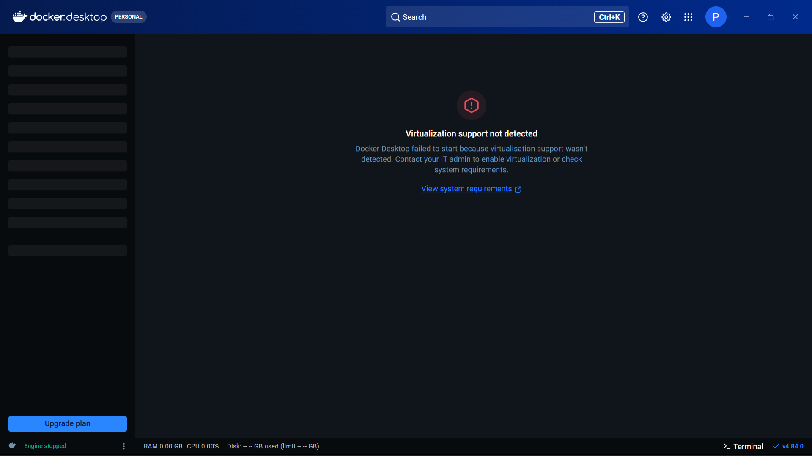
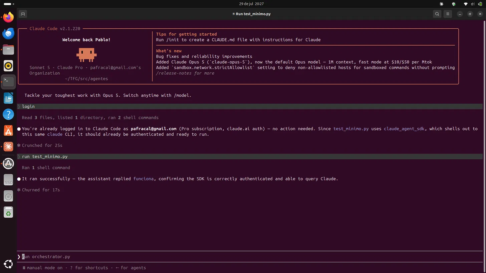
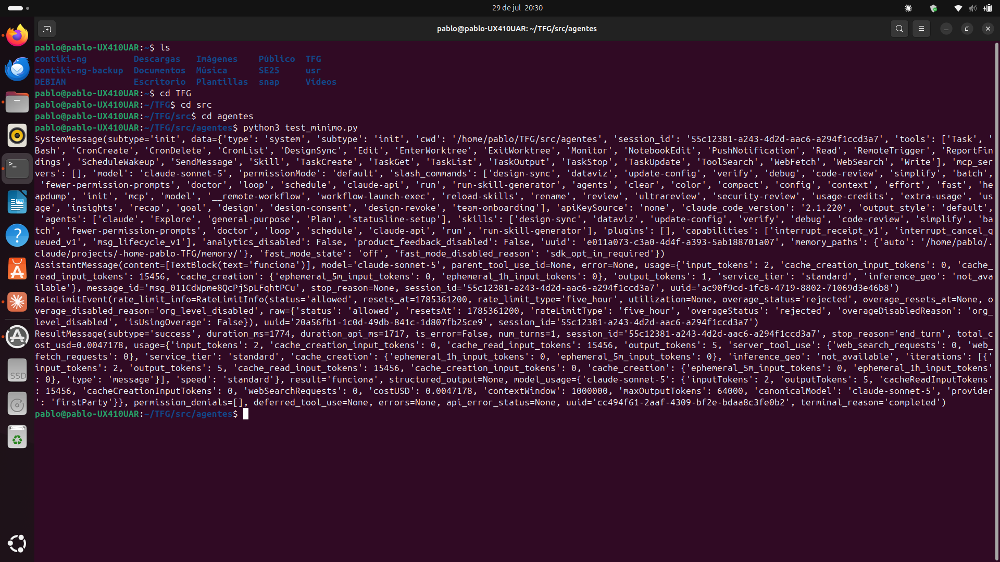
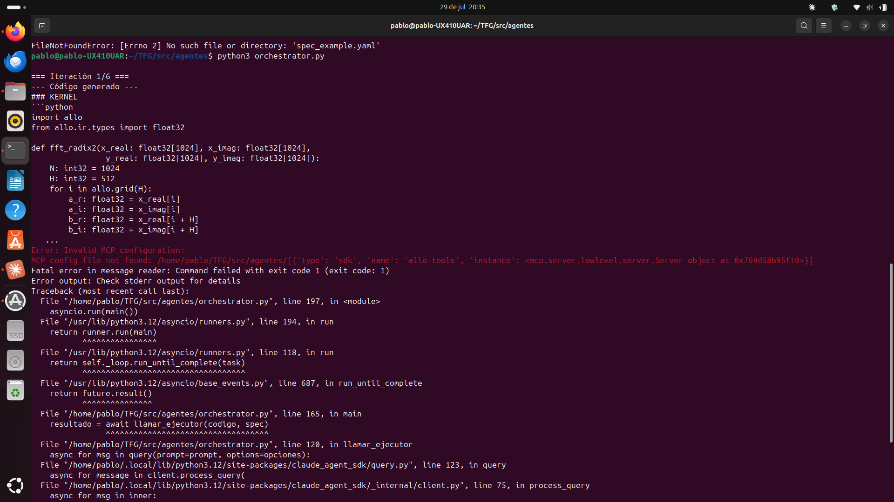
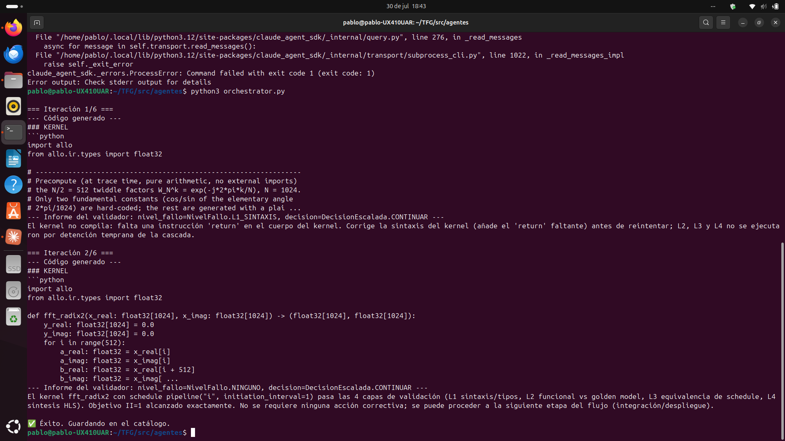
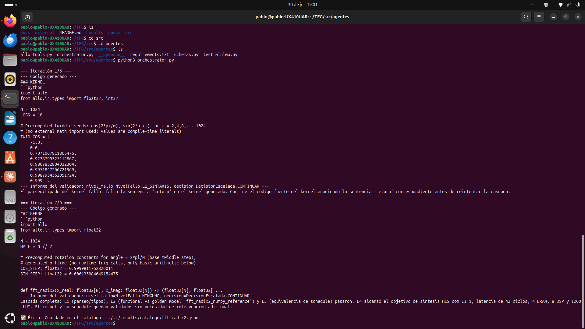

# Bitácora del TFG

Diario de trabajo del Trabajo de Fin de Grado (Ingeniería Industrial):
*generación automática de aceleradores hardware mediante LLMs con
validación en lazo cerrado sobre el lenguaje Allo*.

Formato: fecha, qué se decidió/hizo, qué problemas surgieron y cómo se
resolvieron. Pensado para poder citar en la memoria el "por qué" de cada
decisión sin tener que reconstruirlo de memoria al final.

---

## Arranque del proyecto: arquitectura de agentes

**Contexto.** Recibido por correo el planteamiento del proyecto: generación
automática de código RTL (comunicaciones/procesado de señal — 5G/6G, radar)
mediante LLMs restringidos al DSL Allo (Cornell), con validación en cascada
usando el propio compilador de Allo como oráculo (parseo → tipos → ejecución
contra golden model → equivalencia formal → HLS), y un lazo de reparación
que realimenta los errores al modelo hasta converger.

**Decisión de arquitectura.** Se plantea un pipeline de **3 agentes**
interconectados en vez de un único agente monolítico:

1. **Generador** — escribe código Allo (kernel + schedule) dentro de un
   subconjunto restringido del lenguaje (solo tipos de `allo.ir.types`,
   `allo.grid`, `range`, sin imports externos).
2. **Ejecutor** — corre la cascada de validación real (L1 sintaxis/tipos,
   L2 funcional contra golden model, L3 equivalencia formal de schedules,
   L4 síntesis HLS).
3. **Validador** — traduce la salida cruda del Ejecutor en un informe
   estructurado (JSON tipado) y decide la política de escalada:
   continuar, regenerar desde cero, o congelar el kernel y tocar solo el
   schedule.

**Por qué esta separación de roles** (y no un solo agente que hace todo):
cada rol necesita un contexto y unas herramientas distintas — el Generador
no necesita ejecutar nada, el Ejecutor no necesita "pensar" en lenguaje
natural, y el Validador necesita producir una salida con forma fija para
que el bucle pueda tomar decisiones automáticas sin parsear texto libre.

**Herramienta elegida: Claude Agent SDK.** Se descarta escribir el propio
orquestador de agentes desde cero — el SDK ya da subagentes, herramientas
personalizadas (MCP en proceso), hooks para telemetría, y salidas
estructuradas, que es justo lo que pedía la arquitectura del correo
original.

**Primer esqueleto de código.** Se crea un proyecto Python con:
- `schemas.py` — esquema tipado (Pydantic) del informe del Validador
  (`InformeValidacion`: nivel de fallo, mensaje accionable, diff numérico,
  métricas HLS, decisión de escalada).
- `allo_tools.py` — herramientas del Ejecutor que envuelven la cascada
  L1-L4 del toolchain de Allo (mockeadas al principio, para poder probar
  el bucle completo sin tener Allo instalado todavía).
- `orchestrator.py` — el bucle explícito: Generador → Ejecutor → Validador
  → decisión de escalada, con presupuesto máximo de iteraciones.
- `spec_example.yaml` — primer bloque de prueba: una mariposa FFT
  radix-2 (Cooley-Tukey).

**Decisión sobre orquestación:** explícita en Python (llamadas directas a
`query()` por rol) en vez de dejar que el propio SDK gestione subagentes
automáticamente — se necesita control fino sobre la cascada L1-L5 y la
política de escalada (congelar kernel vs. regenerar desde cero), que es
lógica muy específica del dominio.

---

## Entorno de desarrollo, Allo, y estructura de TFG

**Entorno base en Windows.** Instalación de Node.js, Python, el SDK
(`claude-agent-sdk`), y autenticación con la API. Problemas menores
resueltos: política de ejecución de PowerShell bloqueando `npm`
(`Set-ExecutionPolicy -Scope CurrentUser -ExecutionPolicy RemoteSigned`), y
una API key mal configurada (se guardó el *nombre* de la clave en vez del
valor real).

**Decisión: usar la suscripción Pro en vez de una API key de pago por
uso.** Se confirma que el uso automatizado (Agent SDK / bucles sin
intervención humana) sigue contando dentro de la cuota de Claude Pro
mientras Anthropic mantenga pausado el cambio de facturación anunciado
para el 15 de junio de 2026 — evita tener que cargar saldo en la consola
de API para las pruebas de desarrollo.

**Integración de Allo (real).** Se descubre que Allo depende de compilar
LLVM/MLIR y solo da soporte oficial para Linux (imagen Docker
`chhzh123/allo:latest`, o compilación desde fuente). No hay instalación
nativa en Windows. Además, el repo usa **submódulos de git** — el ZIP de
GitHub no los incluye, así que hay que clonar con
`git clone --recursive`.

**Decisión: entorno unificado en un contenedor** en vez de cruzar llamadas
Windows↔Docker en cada iteración del bucle (menos puntos de fallo). Se
escribe un `Dockerfile` que parte de la imagen oficial de Allo y añade
Node.js + Claude Code CLI + el SDK de Python encima.

**Reestructuración como TFG.** Al confirmarse que este es el Trabajo de
Fin de Grado, se reorganiza todo bajo una estructura de proyecto académico
(`C:\TFG`, fuera de `Documents` para evitar interferencias de OneDrive y
límites de longitud de ruta de Windows):

```
TFG/
├── docs/            (esta bitácora, notas de instalación)
├── docker/          (Dockerfile)
├── src/agentes/     (el pipeline de 3 agentes)
├── specs/           (specs de bloques, p. ej. spec_example.yaml)
├── external/allo/   (Allo como git submodule — permite citar el commit exacto)
└── results/catalogo/ (kernels validados + métricas, según vaya creciendo)
```

**Repositorio en GitHub.** Se crea `TFG-Allo-Agents` como repositorio
**privado** (pendiente de confirmar con el tutor si hay alguna norma de
confidencialidad específica de la universidad antes de hacerlo público).
Allo se añade como **git submodule** (no como clon normal) para poder citar
en la memoria el commit exacto usado, y para no mezclar el historial de
Allo con el del TFG. Autenticación con GitHub vía `gh auth login` en vez de
contraseña (GitHub ya no acepta contraseña plana por `git push`).

---

## Problemas de virtualización en Windows, cambio a Linux

**Intento de levantar Docker Desktop en Windows.** Error
`Virtualization support not detected`. Se descarta que sea por tener
Windows Home (Docker Desktop funciona en Home vía backend WSL2, no
necesita Hyper-V). Se investigan varias causas posibles a lo largo del
día: BIOS/SVM Mode (ya estaba activado), funciones opcionales de Windows
(`VirtualMachinePlatform`, WSL — activadas correctamente solo tras
ejecutar los comandos con PowerShell en modo Administrador, que al
principio no lo estaba), driver residual de VirtualBox (descartado, no
quedaba ninguno), y antivirus de terceros interfiriendo con el hipervisor
(descartado, solo Windows Defender). Ninguna de estas resolvió el problema
— quedó sin diagnosticar la causa raíz exacta en este equipo concreto
(hipótesis más probable: la Seguridad Basada en Virtualización de Windows
11 25H2 reservando el hipervisor de forma exclusiva para Credential Guard,
sin dejar partición libre para WSL2).


*Figura 1. Pantalla de error de Docker Desktop en el equipo Windows de pruebas. El motor queda en estado `Engine stopped` y el arranque no llega a completarse pese a haber descartado las causas habituales (BIOS, VirtualBox, antivirus). Causa raíz no confirmada; hipótesis principal: reserva exclusiva del hipervisor por VBS/Credential Guard en Windows 11 25H2.*

**Decisión: usar un segundo ordenador con Linux nativo** en vez de seguir
depurando la virtualización de Windows. Justificación: Allo está pensado
para Linux de origen — evitar la capa de virtualización elimina de raíz la
categoría entera de problemas que estábamos teniendo, sin perder tiempo en
un diagnóstico que no era imprescindible para el progreso del proyecto (se
puede retomar más adelante si hace falta reproducir el entorno también en
Windows).

**Entorno validado en Linux.** Clonado del repositorio (`git clone
--recurse-submodules`), instalación de dependencias, `claude login` con la
cuenta Pro, y ejecución de `test_minimo.py` — confirmado
`apiKeySource: none` (usando la suscripción, no facturación de API) y
respuesta correcta del modelo, tanto desde Claude Code como desde una
terminal normal de forma independiente.

**Primera comprobación: dentro de Claude Code (sesión interactiva).**
Antes de validar el entorno "en frío" desde una terminal corriente, se hizo
una primera comprobación rápida dentro de la propia sesión de Claude Code
usada para desarrollar el código, pidiéndole textualmente que comprobara el
login y ejecutara `test_minimo.py`.


*Figura 2. Sesión interactiva de Claude Code (v2.1.220) en `~/TFG/src/agentes`. Claude Code confirma que la sesión ya estaba autenticada con la cuenta Pro (`pafracal@gmail.com`) y razona correctamente que, como `test_minimo.py` usa `claude_agent_sdk`, que a su vez invoca el mismo CLI de `claude`, debería quedar autenticado sin pasos adicionales. A continuación ejecuta `test_minimo.py` con éxito ("the assistant replied `funciona`"). En la línea de comandos, ya tecleado y a la espera de confirmación, se aprecia el siguiente paso natural: `run orchestrator.py` — es decir, la tentación de seguir pidiéndole a Claude Code que ejecute también el pipeline completo.*

**Por qué esta comprobación no se usó como validación del entorno, y por
qué no se debe operar el pipeline desde dentro de Claude Code.** El
resultado de la Figura 2 es correcto, pero se descartó deliberadamente como
prueba válida, y se decidió no continuar por ese camino (no se llegó a
escribir `run orchestrator.py`), por dos motivos:

1. **Contaminaría la validación del sistema.** El objetivo del proyecto es
   un pipeline **autónomo**: un script (`orchestrator.py`) que encadena
   Generador → Ejecutor → Validador en bucle, sin intervención humana en
   cada iteración. Si la comprobación de que "funciona" se hace pidiéndoselo
   a Claude Code de forma conversacional, no queda claro si el mérito es
   del propio script o de alguna gestión de contexto/autenticación que
   Claude Code está haciendo por detrás sin que sea evidente desde fuera.
   La única prueba inequívoca de que el sistema es autónomo es que corra
   igual de bien invocado directamente (`python3 test_minimo.py`,
   `python3 orchestrator.py`) desde una terminal corriente, sin ningún
   asistente conversacional de por medio.
2. **Contradiría el objetivo del propio TFG.** Todo el proyecto gira en
   torno a demostrar un lazo de generación-validación que no necesita
   supervisión humana turno a turno. Operar el pipeline pidiéndoselo
   manualmente a un asistente interactivo, aunque sea cómodo durante el
   desarrollo, es exactamente el patrón contrario al que se quiere
   demostrar que funciona.

**Regla práctica adoptada a partir de este punto:** Claude Code se usa
únicamente para escribir y depurar código; toda ejecución que cuente como
resultado o evidencia del proyecto se hace siempre mediante invocación
directa desde terminal, sin mediación de ningún asistente conversacional.

**Entorno validado en Linux (terminal directa).** Clonado del repositorio
(`git clone --recurse-submodules`), instalación de dependencias, `claude
login` con la cuenta Pro, y ejecución de `test_minimo.py` **directamente
desde terminal**, siguiendo la regla anterior — confirmado
`apiKeySource: none` (usando la suscripción, no facturación de API) y
respuesta correcta del modelo.


*Figura 3. Salida completa de `python3 test_minimo.py` invocado directamente desde terminal (sin Claude Code de por medio), en contraste con la Figura 2. El `SystemMessage` confirma `apiKeySource: 'none'` (autenticación vía suscripción Pro, no API de pago por uso); el `AssistantMessage` devuelve el texto esperado (`'funciona'`); el `RateLimitEvent` confirma cuota de cinco horas con `overageDisabledReason: 'org_level_disabled'` (sin riesgo de facturación adicional); y el `ResultMessage` cierra con `is_error=False`. Esta es la ejecución que se toma como validación real del entorno, precisamente por no depender de ningún asistente interactivo.*

**Primera ejecución del pipeline completo (con Allo aún mockeado).**
Se detectan y corrigen dos errores de integración al ejecutar
`orchestrator.py` por primera vez fuera de la carpeta original:
1. Ruta relativa a `spec_example.yaml` rota tras mover el archivo a
   `specs/` — corregido a `../../specs/spec_example.yaml` desde
   `src/agentes/`.
2. `mcp_servers` pasado como lista (`[allo_tools_server]`) en vez de
   diccionario (`{"allo-tools": allo_tools_server}`) al configurar las
   herramientas del Ejecutor — el SDK esperaba un mapeo nombre→servidor,
   no una lista, y lo interpretaba erróneamente como ruta a un archivo de
   configuración.


*Figura 4. Salida de terminal de la primera ejecución de `orchestrator.py` desde su ubicación definitiva. Se observa, al inicio, el rastro del primer error ya resuelto (`FileNotFoundError: 'spec_example.yaml'`); a continuación, el código Allo generado por el agente Generador para el bloque `fft_radix2` (kernel de mariposa FFT radix-2, bucle `allo.grid(H)` con `H=512`); y finalmente el error `Invalid MCP configuration: MCP config file not found`, producido porque el SDK interpretó la lista `[allo_tools_server]` como ruta a un archivo de configuración en lugar de como el servidor MCP ya instanciado — confirmando el segundo bug descrito en el punto 2 anterior. Captura tomada **antes** de aplicar la corrección (diccionario `{"allo-tools": allo_tools_server}`); se conserva como evidencia del proceso de depuración, no como estado final del sistema.*

**Estado al cierre de esta sesión:** el Generador produce código Allo
plausible para la FFT radix-2 de prueba; el Ejecutor y el Validador están
en proceso de validarse con las herramientas aún mockeadas (pendiente de
confirmar una iteración completa exitosa tras el último arreglo).

---

## Arreglo del `mcp_servers`, primera iteración completa y persistencia del catálogo

**Contexto.** Pendiente de la sesión anterior: confirmar que `orchestrator.py`
completa una iteración entera con las herramientas del Ejecutor aún
mockeadas, y verificar que el bug de `mcp_servers` (pasado como lista en vez
de diccionario) estaba realmente corregido en el código.

**Bug confirmado: `mcp_servers` como lista en vez de diccionario.** Al
revisar `orchestrator.py`, el bug seguía presente en `llamar_ejecutor()`:

```python
# Antes (incorrecto)
opciones = ClaudeAgentOptions(
    mcp_servers=[allo_tools_server],   # lista -> el SDK lo trata como ruta a config
    ...
)
```

`ClaudeAgentOptions` espera un **diccionario** `nombre -> servidor`, no una
lista. Al pasar una lista, el SDK intenta interpretar cada elemento como una
ruta a un archivo de configuración MCP externo (formato stdio/HTTP), no como
un objeto de servidor en proceso ya instanciado — el mismo tipo de error de
"Invalid MCP configuration" ya documentado en la Figura 4, pero esta vez
manifestado como `claude_agent_sdk._errors.ProcessError: Command failed
with exit code 1` en una ejecución posterior.

Arreglo aplicado:

```python
# Después (correcto)
opciones = ClaudeAgentOptions(
    mcp_servers={"allo-tools": allo_tools_server},
    allowed_tools=[
        "mcp__allo-tools__run_l1_parse_types",
        "mcp__allo-tools__run_l2_functional",
        "mcp__allo-tools__run_l3_equivalence",
        "mcp__allo-tools__run_l4_hls",
    ],
)
```

El nombre `"allo-tools"` en el diccionario debe coincidir con el prefijo
`mcp__allo-tools__` usado en `allowed_tools`.


*Figura 5. Terminal con el rastro (scroll hacia arriba) del `ProcessError: Command failed with exit code 1` de una ejecución anterior al arreglo del diccionario `mcp_servers`, seguido inmediatamente de una ejecución ya corregida de `orchestrator.py`: iteración 1 falla en L1 (falta `return` en el kernel generado), iteración 2 genera un kernel con tabla de twiddle factors precalculada, pasa L1-L3 y alcanza II=1 en L4, cerrando con `✅ Éxito. Guardando en el catálogo.`*

**Primera iteración completa confirmada.** Con el arreglo aplicado, se
ejecuta `orchestrator.py` limpio desde `src/agentes/`:

```bash
cd ~/TFG/src/agentes
python3 orchestrator.py
```

Resultado:
- **Iteración 1/6:** el Generador escribe un kernel con una tabla de
  twiddle factors precalculada como lista de literales (`TWID_COS = [...]`).
  Falla en **L1** porque falta la sentencia `return` en el kernel — el
  Validador devuelve `decision=CONTINUAR` con el mensaje accionable
  correspondiente.
- **Iteración 2/6:** el Generador corrige el enfoque, esta vez generando
  los twiddle factors por rotación iterativa (`COS_STEP`, `SIN_STEP`) en
  vez de una tabla de literales, e incluye el `return`. Pasa las 4 capas
  (L1 sintaxis/tipos, L2 funcional contra `fft_radix2_numpy_reference`, L3
  equivalencia de schedule, L4 síntesis HLS con II=1 exacto).
- Resultado final: `✅ Éxito. Guardado en el catálogo:
  ../../results/catalogo/fft_radix2.json`


*Figura 6. Salida completa de la ejecución de `orchestrator.py` ya con el arreglo de `mcp_servers` aplicado, mostrando la corrección automática entre iteración 1 y 2, y el mensaje final de guardado en `results/catalogo/fft_radix2.json`.*

**Bug encontrado: el catálogo no se persistía a disco.** Al revisar el
código tras el primer `✅ Éxito`, se detecta que el mensaje "Guardando en el
catálogo" era engañoso: solo hacía `catalogo_validados.append(...)` a una
lista **en memoria**, local a `main()`. Al terminar el script, esa lista se
perdía — no se escribía nada a `results/catalogo/`, a pesar de que la
carpeta ya existía en la estructura del repo para ese propósito.

Arreglo aplicado: nueva función `guardar_en_catalogo()` en
`orchestrator.py` que escribe un JSON a `results/catalogo/<bloque>.json`
(el nombre del bloque viene del campo `spec["bloque"]`) con la spec
completa, el código Allo generado (kernel + schedule) y las métricas HLS:

```python
def guardar_en_catalogo(spec: dict, codigo: str, metricas: dict | None) -> str:
    os.makedirs(DIR_CATALOGO, exist_ok=True)
    registro = {
        "bloque": spec.get("bloque", "sin_nombre"),
        "spec": spec,
        "codigo_allo": codigo,
        "metricas_hls": metricas,
    }
    ruta = os.path.join(DIR_CATALOGO, f"{registro['bloque']}.json")
    with open(ruta, "w") as f:
        json.dump(registro, f, indent=2, ensure_ascii=False)
    return ruta
```

Llamada desde `main()` en el momento de éxito, sustituyendo el `print` que
no hacía nada:

```python
if informe.nivel_fallo == NivelFallo.NINGUNO:
    ruta = guardar_en_catalogo(spec, codigo, informe.metricas_hls)
    print(f"\n✅ Éxito. Guardado en el catálogo: {ruta}")
    ...
```

Verificado con `cat ../../results/catalogo/fft_radix2.json` — el archivo
contiene la spec, el código Allo (kernel con rotación iterativa de twiddle
factors + schedule con `pipeline("k")` y `pipeline("kb")` a II=1), y las
métricas mockeadas (`II=1, latencia=42, BRAM=4, DSP=8, LUT=1200`).

**Nota importante:** estas métricas siguen siendo del mock de
`run_l4_hls` (valores fijos salvo el II) — no representan una síntesis
real todavía. Sirven para confirmar que el *mecanismo* de persistencia
funciona de punta a punta, no para sacar conclusiones sobre recursos reales
de hardware.

**Estado al cierre de esta sesión:** el punto pendiente de confirmar la
iteración completa mockeada queda **cerrado** — el pipeline corre de
principio a fin, con reintento tras fallo en L1 y éxito en la siguiente
iteración, y ahora sí persiste el resultado en `results/catalogo/`.

---

## Pendiente para la siguiente sesión

- Instalar Allo de verdad en el Linux (`pip install -e .` dentro de
  `external/allo`) y sustituir las funciones `MOCK_*` de `allo_tools.py`
  por llamadas reales (`allo.customize()`, `s.build()`, el verificador
  formal, síntesis HLS), empezando por `run_l1_parse_types` al ser la más
  sencilla.
- Definir cómo se resuelve `golden_model_id` (p. ej.
  `"fft_radix2_numpy_reference"`) contra una función NumPy real que genere
  los vectores de test — todavía no existe esa convención en el repo.
- Decidir si el RTL/HLS real que produzca L4 (cuando Allo esté conectado
  de verdad) se persiste también en `results/catalogo/`, y en qué formato.
- Decidir si se generaliza `main()` para iterar sobre varios ficheros de
  `specs/` en vez de tener la ruta a `spec_example.yaml` hardcodeada.
- Decidir si se retoma el diagnóstico de virtualización en el equipo
  Windows (para poder reproducir el entorno en ambas máquinas) o se
  documenta como limitación conocida del entorno de desarrollo.
- Confirmar con el tutor si el repositorio debe mantenerse privado por
  alguna norma específica de la universidad o del colaborador que propuso
  el proyecto.
