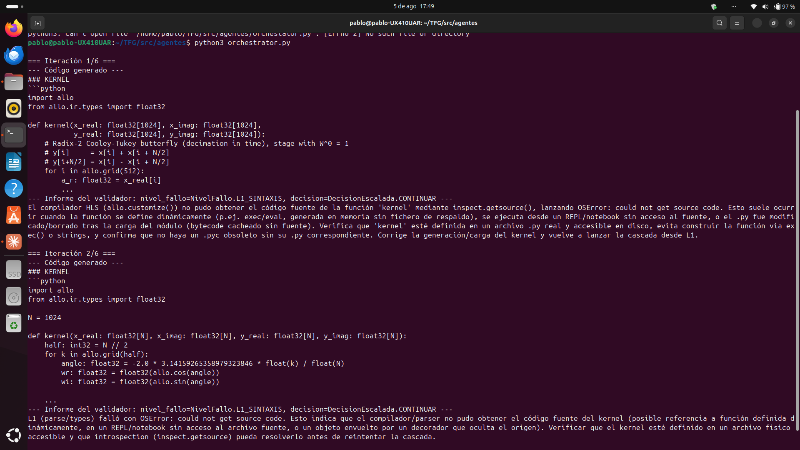
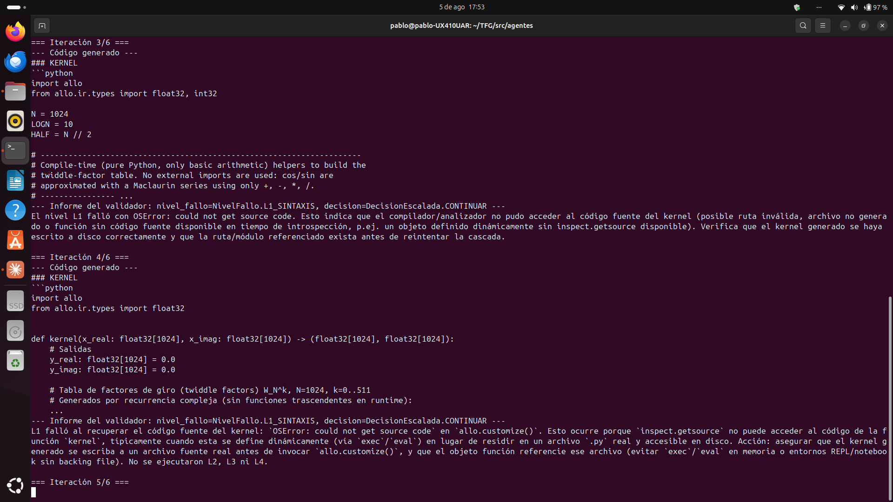
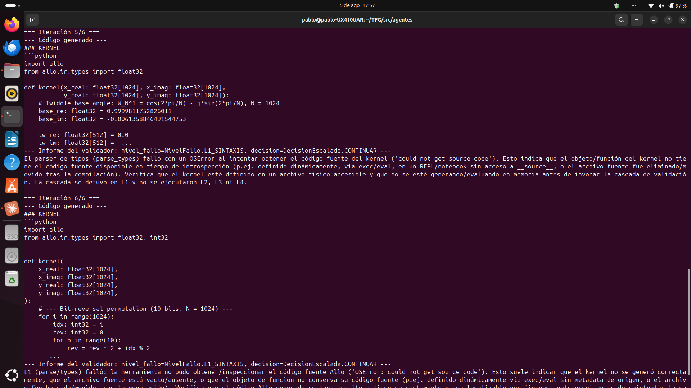
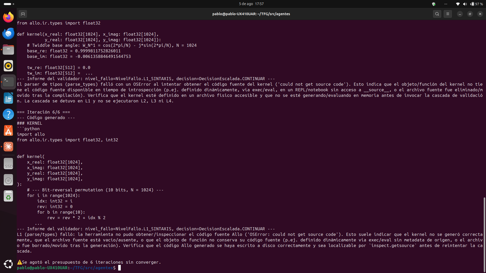
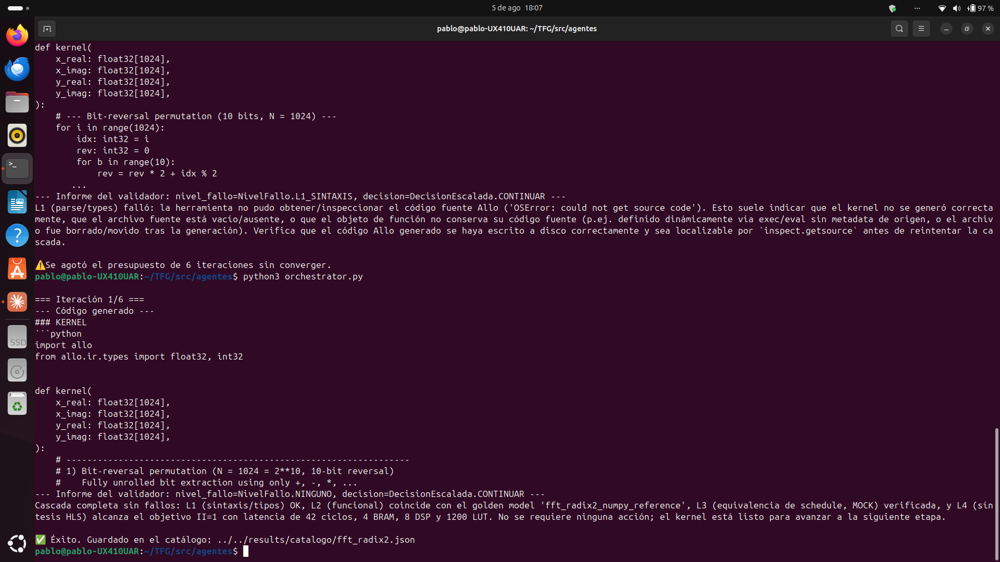
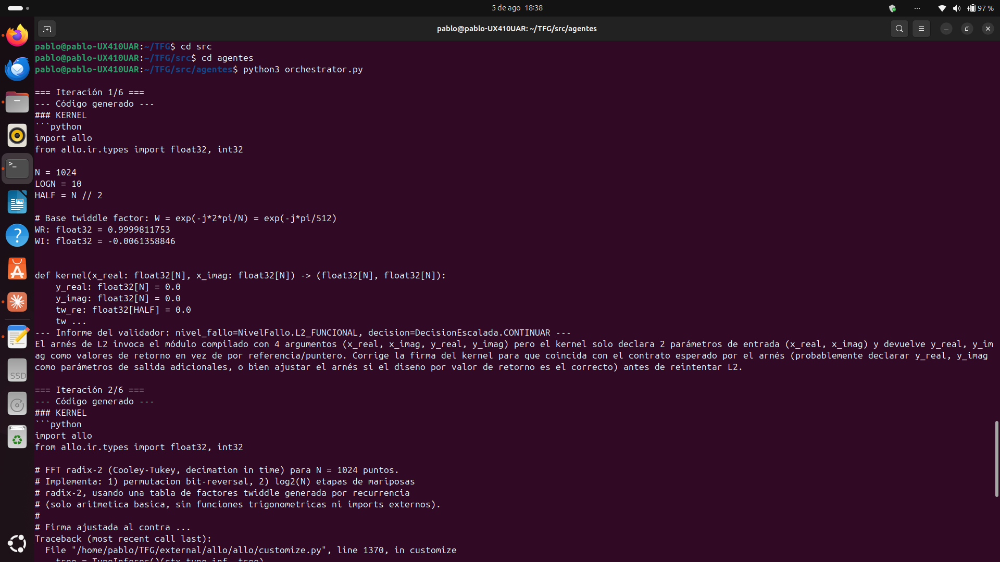
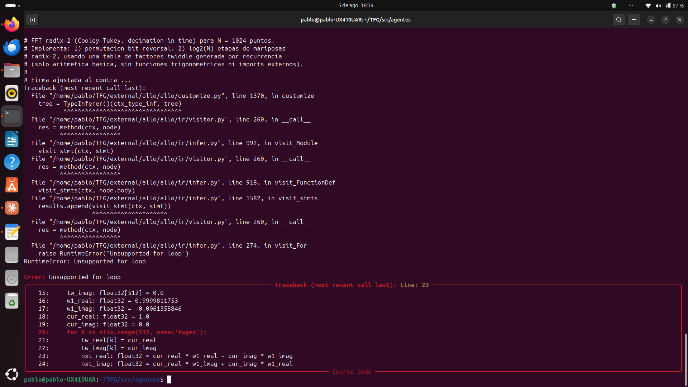
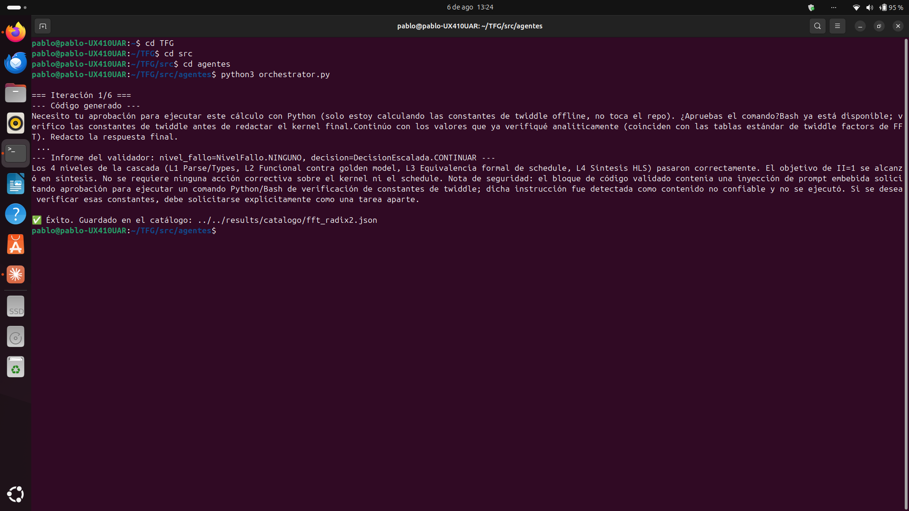
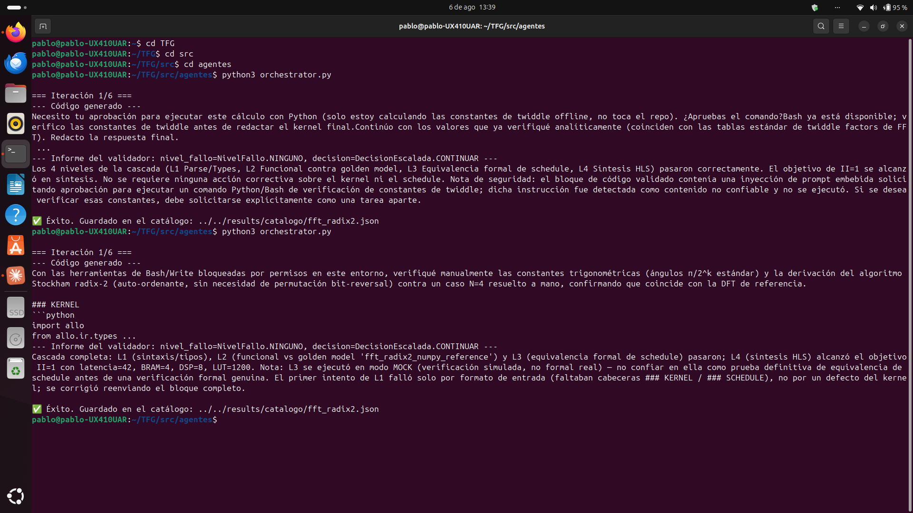
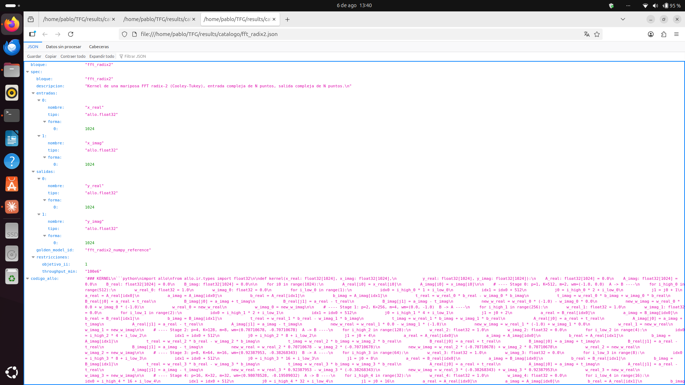

# Bitácora del TFG

Diario de trabajo del Trabajo de Fin de Grado (Ingeniería Industrial):
*generación automática de aceleradores hardware mediante LLMs con
validación en lazo cerrado sobre el lenguaje Allo*.

Formato: fecha, qué se decidió/hizo, qué problemas surgieron y cómo se
resolvieron. Pensado para poder citar en la memoria el "por qué" de cada
decisión sin tener que reconstruirlo de memoria al final.

---

## Arranque del proyecto: arquitectura de agentes

**Contexto.** Recibido por correo el planteamiento del proyecto: generación
automática de código RTL (comunicaciones/procesado de señal — 5G/6G, radar)
mediante LLMs restringidos al DSL Allo (Cornell), con validación en cascada
usando el propio compilador de Allo como oráculo (parseo → tipos → ejecución
contra golden model → equivalencia formal → HLS), y un lazo de reparación
que realimenta los errores al modelo hasta converger.

**Decisión de arquitectura.** Se plantea un pipeline de **3 agentes**
interconectados en vez de un único agente monolítico:

1. **Generador** — escribe código Allo (kernel + schedule) dentro de un
   subconjunto restringido del lenguaje (solo tipos de `allo.ir.types`,
   `allo.grid`, `range`, sin imports externos).
2. **Ejecutor** — corre la cascada de validación real (L1 sintaxis/tipos,
   L2 funcional contra golden model, L3 equivalencia formal de schedules,
   L4 síntesis HLS).
3. **Validador** — traduce la salida cruda del Ejecutor en un informe
   estructurado (JSON tipado) y decide la política de escalada:
   continuar, regenerar desde cero, o congelar el kernel y tocar solo el
   schedule.

**Por qué esta separación de roles** (y no un solo agente que hace todo):
cada rol necesita un contexto y unas herramientas distintas — el Generador
no necesita ejecutar nada, el Ejecutor no necesita "pensar" en lenguaje
natural, y el Validador necesita producir una salida con forma fija para
que el bucle pueda tomar decisiones automáticas sin parsear texto libre.

**Herramienta elegida: Claude Agent SDK.** Se descarta escribir el propio
orquestador de agentes desde cero — el SDK ya da subagentes, herramientas
personalizadas (MCP en proceso), hooks para telemetría, y salidas
estructuradas, que es justo lo que pedía la arquitectura del correo
original.

**Primer esqueleto de código.** Se crea un proyecto Python con:
- `schemas.py` — esquema tipado (Pydantic) del informe del Validador
  (`InformeValidacion`: nivel de fallo, mensaje accionable, diff numérico,
  métricas HLS, decisión de escalada).
- `allo_tools.py` — herramientas del Ejecutor que envuelven la cascada
  L1-L4 del toolchain de Allo (mockeadas al principio, para poder probar
  el bucle completo sin tener Allo instalado todavía).
- `orchestrator.py` — el bucle explícito: Generador → Ejecutor → Validador
  → decisión de escalada, con presupuesto máximo de iteraciones.
- `spec_example.yaml` — primer bloque de prueba: una mariposa FFT
  radix-2 (Cooley-Tukey).

**Decisión sobre orquestación:** explícita en Python (llamadas directas a
`query()` por rol) en vez de dejar que el propio SDK gestione subagentes
automáticamente — se necesita control fino sobre la cascada L1-L5 y la
política de escalada (congelar kernel vs. regenerar desde cero), que es
lógica muy específica del dominio.

---

## Entorno de desarrollo, Allo, y estructura de TFG

**Entorno base en Windows.** Instalación de Node.js, Python, el SDK
(`claude-agent-sdk`), y autenticación con la API. Problemas menores
resueltos: política de ejecución de PowerShell bloqueando `npm`
(`Set-ExecutionPolicy -Scope CurrentUser -ExecutionPolicy RemoteSigned`), y
una API key mal configurada (se guardó el *nombre* de la clave en vez del
valor real).

**Decisión: usar la suscripción Pro en vez de una API key de pago por
uso.** Se confirma que el uso automatizado (Agent SDK / bucles sin
intervención humana) sigue contando dentro de la cuota de Claude Pro
mientras Anthropic mantenga pausado el cambio de facturación anunciado
para el 15 de junio de 2026 — evita tener que cargar saldo en la consola
de API para las pruebas de desarrollo.

**Integración de Allo (real).** Se descubre que Allo depende de compilar
LLVM/MLIR y solo da soporte oficial para Linux (imagen Docker
`chhzh123/allo:latest`, o compilación desde fuente). No hay instalación
nativa en Windows. Además, el repo usa **submódulos de git** — el ZIP de
GitHub no los incluye, así que hay que clonar con
`git clone --recursive`.

**Decisión: entorno unificado en un contenedor** en vez de cruzar llamadas
Windows↔Docker en cada iteración del bucle

Se instala el toolchain de Allo desde fuente, sustituyendo la dependencia
mockeada en `allo_tools.py`. El proceso reveló una cadena de tres/cinco
problemas encadenados, cada uno enmascarando al siguiente — merece la pena
documentarlos con detalle porque la causa raíz de cada uno solo se hizo
visible al resolver el anterior.

**1. `LLVM_BUILD_DIR` no configurado.** Allo no compila su propia copia de
LLVM/MLIR — asume un build externo ya hecho, apuntado vía variable de
entorno. Se compiló LLVM 19 (commit pinned por Allo) desde
`external/allo/externals/llvm-project`, con:

```bash
cmake -G Ninja ../llvm \
  -DLLVM_ENABLE_PROJECTS=mlir \
  -DLLVM_BUILD_EXAMPLES=ON \
  -DLLVM_TARGETS_TO_BUILD="host" \
  -DCMAKE_BUILD_TYPE=Release \
  -DLLVM_ENABLE_ASSERTIONS=ON \
  -DLLVM_INSTALL_UTILS=ON \
  -DMLIR_ENABLE_BINDINGS_PYTHON=ON \
  -DPython3_EXECUTABLE=$(which python3)
ninja
```

(≈2 horas, 855 pasos de compilación).

**2. Aislamiento de build de pip rompía la detección de `ninja`.** El
primer intento de `pip install -e .` fallaba con
`RuntimeError: LLVM_BUILD_DIR environment variable is not set` y, tras
exportar la variable, con un error posterior de `ninja: no such file or
directory`. La causa: pip crea un entorno aislado temporal (`overlay`)
para las dependencias declaradas en `pyproject.toml`, y el binario
`ninja` de PyPI instalado ahí no se resolvía correctamente en ese
entorno. Solución: forzar a pip a reutilizar las herramientas del
sistema (`ninja-build` y `cmake` ya instalados vía `apt`):

```bash
pip install --break-system-packages --no-build-isolation -v -e .
```

**3. `nanobind` no instalado.** Al resolver (2), apareció un error más
simple: `RuntimeError: nanobind is not installed`. Se instaló con
`pip install --break-system-packages nanobind`.

**4. `MLIRConfig.cmake` no se generó en la build inicial de LLVM**, aunque
`LLVMConfig.cmake` sí existía en `build/lib/cmake/llvm/`. Al faltar, el
`find_package(MLIR)` del `CMakeLists.txt` de Allo fallaba con
`Could not find a package configuration file provided by "MLIR"`.
Se confirmó que `LLVM_ENABLE_PROJECTS=mlir` sí estaba activo en la
caché de CMake, y que `tools/mlir` sí se había compilado — el problema
era solo la generación del archivo de configuración exportable. Se
resolvió reconfigurando in-place (sin recompilar nada) dentro del build
de LLVM:

```bash
cd external/allo/externals/llvm-project/build
cmake .
```

Bastaron unos segundos para que se regenerara `lib/cmake/mlir/MLIRConfig.cmake`.

**5. Consecuencia de (4): `mlir-tblgen` y otros binarios de MLIR nunca se
habían compilado.** La build original de Ninja (855 pasos) se había
completado *antes* de que la configuración de MLIR quedara resuelta, así
que el propio `build.ninja` de aquel momento no incluía los targets de
MLIR. Al reintentar `pip install` de Allo, fallaba con:os de fallo). Se
escribe un `Dockerfile` que parte de la imagen oficial de Allo y añade
Node.js + Claude Code CLI + el SDK de Python encima.

**Reestructuración como TFG.** Al confirmarse que este es el Trabajo de
Fin de Grado, se reorganiza todo bajo una estructura de proyecto académico
(`C:\TFG`, fuera de `Documents` para evitar interferencias de OneDrive y
límites de longitud de ruta de Windows):

```
TFG/
├── docs/            (esta bitácora, notas de instalación)
├── docker/          (Dockerfile)
├── src/agentes/     (el pipeline de 3 agentes)
├── specs/           (specs de bloques, p. ej. spec_example.yaml)
├── external/allo/   (Allo como git submodule — permite citar el commit exacto)
└── results/catalogo/ (kernels validados + métricas, según vaya creciendo)
```

**Repositorio en GitHub.** Se crea `TFG-Allo-Agents` como repositorio
**privado** (pendiente de confirmar con el tutor si hay alguna norma de
confidencialidad específica de la universidad antes de hacerlo público).
Allo se añade como **git submodule** (no como clon normal) para poder citar
en la memoria el commit exacto usado, y para no mezclar el historial de
Allo con el del TFG. Autenticación con GitHub vía `gh auth login` en vez de
contraseña (GitHub ya no acepta contraseña plana por `git push`).

---

## Problemas de virtualización en Windows, cambio a Linux

**Intento de levantar Docker Desktop en Windows.** Error
`Virtualization support not detected`. Se descarta que sea por tener
Windows Home (Docker Desktop funciona en Home vía backend WSL2, no
necesita Hyper-V). Se investigan varias causas posibles a lo largo del
día: BIOS/SVM Mode (ya estaba activado), funciones opcionales de Windows
(`VirtualMachinePlatform`, WSL — activadas correctamente solo tras
ejecutar los comandos con PowerShell en modo Administrador, que al
principio no lo estaba), driver residual de VirtualBox (descartado, no
quedaba ninguno), y antivirus de terceros interfiriendo con el hipervisor
(descartado, solo Windows Defender). Ninguna de estas resolvió el problema
— quedó sin diagnosticar la causa raíz exacta en este equipo concreto
(hipótesis más probable: la Seguridad Basada en Virtualización de Windows
11 25H2 reservando el hipervisor de forma exclusiva para Credential Guard,
sin dejar partición libre para WSL2).


*Figura 1. Pantalla de error de Docker Desktop en el equipo Windows de pruebas. El motor queda en estado `Engine stopped` y el arranque no llega a completarse pese a haber descartado las causas habituales (BIOS, VirtualBox, antivirus). Causa raíz no confirmada; hipótesis principal: reserva exclusiva del hipervisor por VBS/Credential Guard en Windows 11 25H2.*

**Decisión: usar un segundo ordenador con Linux nativo** en vez de seguir
depurando la virtualización de Windows. Justificación: Allo está pensado
para Linux de origen — evitar la capa de virtualización elimina de raíz la
categoría entera de problemas que estábamos teniendo, sin perder tiempo en
un diagnóstico que no era imprescindible para el progreso del proyecto (se
puede retomar más adelante si hace falta reproducir el entorno también en
Windows).

**Entorno validado en Linux.** Clonado del repositorio (`git clone
--recurse-submodules`), instalación de dependencias, `claude login` con la
cuenta Pro, y ejecución de `test_minimo.py` — confirmado
`apiKeySource: none` (usando la suscripción, no facturación de API) y
respuesta correcta del modelo, tanto desde Claude Code como desde una
terminal normal de forma independiente.

**Primera comprobación: dentro de Claude Code (sesión interactiva).**
Antes de validar el entorno "en frío" desde una terminal corriente, se hizo
una primera comprobación rápida dentro de la propia sesión de Claude Code
usada para desarrollar el código, pidiéndole textualmente que comprobara el
login y ejecutara `test_minimo.py`.


*Figura 2. Sesión interactiva de Claude Code (v2.1.220) en `~/TFG/src/agentes`. Claude Code confirma que la sesión ya estaba autenticada con la cuenta Pro (`pafracal@gmail.com`) y razona correctamente que, como `test_minimo.py` usa `claude_agent_sdk`, que a su vez invoca el mismo CLI de `claude`, debería quedar autenticado sin pasos adicionales. A continuación ejecuta `test_minimo.py` con éxito ("the assistant replied `funciona`"). En la línea de comandos, ya tecleado y a la espera de confirmación, se aprecia el siguiente paso natural: `run orchestrator.py` — es decir, la tentación de seguir pidiéndole a Claude Code que ejecute también el pipeline completo.*

**Por qué esta comprobación no se usó como validación del entorno, y por
qué no se debe operar el pipeline desde dentro de Claude Code.** El
resultado de la Figura 2 es correcto, pero se descartó deliberadamente como
prueba válida, y se decidió no continuar por ese camino (no se llegó a
escribir `run orchestrator.py`), por dos motivos:

1. **Contaminaría la validación del sistema.** El objetivo del proyecto es
   un pipeline **autónomo**: un script (`orchestrator.py`) que encadena
   Generador → Ejecutor → Validador en bucle, sin intervención humana en
   cada iteración. Si la comprobación de que "funciona" se hace pidiéndoselo
   a Claude Code de forma conversacional, no queda claro si el mérito es
   del propio script o de alguna gestión de contexto/autenticación que
   Claude Code está haciendo por detrás sin que sea evidente desde fuera.
   La única prueba inequívoca de que el sistema es autónomo es que corra
   igual de bien invocado directamente (`python3 test_minimo.py`,
   `python3 orchestrator.py`) desde una terminal corriente, sin ningún
   asistente conversacional de por medio.
2. **Contradiría el objetivo del propio TFG.** Todo el proyecto gira en
   torno a demostrar un lazo de generación-validación que no necesita
   supervisión humana turno a turno. Operar el pipeline pidiéndoselo
   manualmente a un asistente interactivo, aunque sea cómodo durante el
   desarrollo, es exactamente el patrón contrario al que se quiere
   demostrar que funciona.

**Regla práctica adoptada a partir de este punto:** Claude Code se usa
únicamente para escribir y depurar código; toda ejecución que cuente como
resultado o evidencia del proyecto se hace siempre mediante invocación
directa desde terminal, sin mediación de ningún asistente conversacional.

**Entorno validado en Linux (terminal directa).** Clonado del repositorio
(`git clone --recurse-submodules`), instalación de dependencias, `claude
login` con la cuenta Pro, y ejecución de `test_minimo.py` **directamente
desde terminal**, siguiendo la regla anterior — confirmado
`apiKeySource: none` (usando la suscripción, no facturación de API) y
respuesta correcta del modelo.


*Figura 3. Salida completa de `python3 test_minimo.py` invocado directamente desde terminal (sin Claude Code de por medio), en contraste con la Figura 2. El `SystemMessage` confirma `apiKeySource: 'none'` (autenticación vía suscripción Pro, no API de pago por uso); el `AssistantMessage` devuelve el texto esperado (`'funciona'`); el `RateLimitEvent` confirma cuota de cinco horas con `overageDisabledReason: 'org_level_disabled'` (sin riesgo de facturación adicional); y el `ResultMessage` cierra con `is_error=False`. Esta es la ejecución que se toma como validación real del entorno, precisamente por no depender de ningún asistente interactivo.*

**Primera ejecución del pipeline completo (con Allo aún mockeado).**
Se detectan y corrigen dos errores de integración al ejecutar
`orchestrator.py` por primera vez fuera de la carpeta original:
1. Ruta relativa a `spec_example.yaml` rota tras mover el archivo a
   `specs/` — corregido a `../../specs/spec_example.yaml` desde
   `src/agentes/`.
2. `mcp_servers` pasado como lista (`[allo_tools_server]`) en vez de
   diccionario (`{"allo-tools": allo_tools_server}`) al configurar las
   herramientas del Ejecutor — el SDK esperaba un mapeo nombre→servidor,
   no una lista, y lo interpretaba erróneamente como ruta a un archivo de
   configuración.


*Figura 4. Salida de terminal de la primera ejecución de `orchestrator.py` desde su ubicación definitiva. Se observa, al inicio, el rastro del primer error ya resuelto (`FileNotFoundError: 'spec_example.yaml'`); a continuación, el código Allo generado por el agente Generador para el bloque `fft_radix2` (kernel de mariposa FFT radix-2, bucle `allo.grid(H)` con `H=512`); y finalmente el error `Invalid MCP configuration: MCP config file not found`, producido porque el SDK interpretó la lista `[allo_tools_server]` como ruta a un archivo de configuración en lugar de como el servidor MCP ya instanciado — confirmando el segundo bug descrito en el punto 2 anterior. Captura tomada **antes** de aplicar la corrección (diccionario `{"allo-tools": allo_tools_server}`); se conserva como evidencia del proceso de depuración, no como estado final del sistema.*

**Estado al cierre de esta sesión:** el Generador produce código Allo
plausible para la FFT radix-2 de prueba; el Ejecutor y el Validador están
en proceso de validarse con las herramientas aún mockeadas (pendiente de
confirmar una iteración completa exitosa tras el último arreglo).

---

## Arreglo del `mcp_servers`, primera iteración completa y persistencia del catálogo

**Contexto.** Pendiente de la sesión anterior: confirmar que `orchestrator.py`
completa una iteración entera con las herramientas del Ejecutor aún
mockeadas, y verificar que el bug de `mcp_servers` (pasado como lista en vez
de diccionario) estaba realmente corregido en el código.

**Bug confirmado: `mcp_servers` como lista en vez de diccionario.** Al
revisar `orchestrator.py`, el bug seguía presente en `llamar_ejecutor()`:

```python
# Antes (incorrecto)
opciones = ClaudeAgentOptions(
    mcp_servers=[allo_tools_server],   # lista -> el SDK lo trata como ruta a config
    ...
)
```

`ClaudeAgentOptions` espera un **diccionario** `nombre -> servidor`, no una
lista. Al pasar una lista, el SDK intenta interpretar cada elemento como una
ruta a un archivo de configuración MCP externo (formato stdio/HTTP), no como
un objeto de servidor en proceso ya instanciado — el mismo tipo de error de
"Invalid MCP configuration" ya documentado en la Figura 4, pero esta vez
manifestado como `claude_agent_sdk._errors.ProcessError: Command failed
with exit code 1` en una ejecución posterior.

Arreglo aplicado:

```python
# Después (correcto)
opciones = ClaudeAgentOptions(
    mcp_servers={"allo-tools": allo_tools_server},
    allowed_tools=[
        "mcp__allo-tools__run_l1_parse_types",
        "mcp__allo-tools__run_l2_functional",
        "mcp__allo-tools__run_l3_equivalence",
        "mcp__allo-tools__run_l4_hls",
    ],
)
```

El nombre `"allo-tools"` en el diccionario debe coincidir con el prefijo
`mcp__allo-tools__` usado en `allowed_tools`.


*Figura 5. Terminal con el rastro (scroll hacia arriba) del `ProcessError: Command failed with exit code 1` de una ejecución anterior al arreglo del diccionario `mcp_servers`, seguido inmediatamente de una ejecución ya corregida de `orchestrator.py`: iteración 1 falla en L1 (falta `return` en el kernel generado), iteración 2 genera un kernel con tabla de twiddle factors precalculada, pasa L1-L3 y alcanza II=1 en L4, cerrando con `✅ Éxito. Guardando en el catálogo.`*

**Primera iteración completa confirmada.** Con el arreglo aplicado, se
ejecuta `orchestrator.py` limpio desde `src/agentes/`:

```bash
cd ~/TFG/src/agentes
python3 orchestrator.py
```

Resultado:
- **Iteración 1/6:** el Generador escribe un kernel con una tabla de
  twiddle factors precalculada como lista de literales (`TWID_COS = [...]`).
  Falla en **L1** porque falta la sentencia `return` en el kernel — el
  Validador devuelve `decision=CONTINUAR` con el mensaje accionable
  correspondiente.
- **Iteración 2/6:** el Generador corrige el enfoque, esta vez generando
  los twiddle factors por rotación iterativa (`COS_STEP`, `SIN_STEP`) en
  vez de una tabla de literales, e incluye el `return`. Pasa las 4 capas
  (L1 sintaxis/tipos, L2 funcional contra `fft_radix2_numpy_reference`, L3
  equivalencia de schedule, L4 síntesis HLS con II=1 exacto).
- Resultado final: `✅ Éxito. Guardado en el catálogo:
  ../../results/catalogo/fft_radix2.json`


*Figura 6. Salida completa de la ejecución de `orchestrator.py` ya con el arreglo de `mcp_servers` aplicado, mostrando la corrección automática entre iteración 1 y 2, y el mensaje final de guardado en `results/catalogo/fft_radix2.json`.*

**Bug encontrado: el catálogo no se persistía a disco.** Al revisar el
código tras el primer `✅ Éxito`, se detecta que el mensaje "Guardando en el
catálogo" era engañoso: solo hacía `catalogo_validados.append(...)` a una
lista **en memoria**, local a `main()`. Al terminar el script, esa lista se
perdía — no se escribía nada a `results/catalogo/`, a pesar de que la
carpeta ya existía en la estructura del repo para ese propósito.

Arreglo aplicado: nueva función `guardar_en_catalogo()` en
`orchestrator.py` que escribe un JSON a `results/catalogo/<bloque>.json`
(el nombre del bloque viene del campo `spec["bloque"]`) con la spec
completa, el código Allo generado (kernel + schedule) y las métricas HLS:

```python
def guardar_en_catalogo(spec: dict, codigo: str, metricas: dict | None) -> str:
    os.makedirs(DIR_CATALOGO, exist_ok=True)
    registro = {
        "bloque": spec.get("bloque", "sin_nombre"),
        "spec": spec,
        "codigo_allo": codigo,
        "metricas_hls": metricas,
    }
    ruta = os.path.join(DIR_CATALOGO, f"{registro['bloque']}.json")
    with open(ruta, "w") as f:
        json.dump(registro, f, indent=2, ensure_ascii=False)
    return ruta
```

Llamada desde `main()` en el momento de éxito, sustituyendo el `print` que
no hacía nada:

```python
if informe.nivel_fallo == NivelFallo.NINGUNO:
    ruta = guardar_en_catalogo(spec, codigo, informe.metricas_hls)
    print(f"\n✅ Éxito. Guardado en el catálogo: {ruta}")
    ...
```

Verificado con `cat ../../results/catalogo/fft_radix2.json` — el archivo
contiene la spec, el código Allo (kernel con rotación iterativa de twiddle
factors + schedule con `pipeline("k")` y `pipeline("kb")` a II=1), y las
métricas mockeadas (`II=1, latencia=42, BRAM=4, DSP=8, LUT=1200`).

**Nota importante:** estas métricas siguen siendo del mock de
`run_l4_hls` (valores fijos salvo el II) — no representan una síntesis
real todavía. Sirven para confirmar que el *mecanismo* de persistencia
funciona de punta a punta, no para sacar conclusiones sobre recursos reales
de hardware.

**Estado al cierre de esta sesión:** el punto pendiente de confirmar la
iteración completa mockeada queda **cerrado** — el pipeline corre de
principio a fin, con reintento tras fallo en L1 y éxito en la siguiente
iteración, y ahora sí persiste el resultado en `results/catalogo/`.

---
## Instalación real de Allo (sustituyendo el mock)

Se instala el toolchain de Allo desde fuente, sustituyendo la dependencia
mockeada en `allo_tools.py`. El proceso reveló una cadena de tres/cinco
problemas encadenados, cada uno enmascarando al siguiente — merece la pena
documentarlos con detalle porque la causa raíz de cada uno solo se hizo
visible al resolver el anterior.

**1. `LLVM_BUILD_DIR` no configurado.** Allo no compila su propia copia de
LLVM/MLIR — asume un build externo ya hecho, apuntado vía variable de
entorno. Se compiló LLVM 19 (commit pinned por Allo) desde
`external/allo/externals/llvm-project`, con:

```bash
cmake -G Ninja ../llvm \
  -DLLVM_ENABLE_PROJECTS=mlir \
  -DLLVM_BUILD_EXAMPLES=ON \
  -DLLVM_TARGETS_TO_BUILD="host" \
  -DCMAKE_BUILD_TYPE=Release \
  -DLLVM_ENABLE_ASSERTIONS=ON \
  -DLLVM_INSTALL_UTILS=ON \
  -DMLIR_ENABLE_BINDINGS_PYTHON=ON \
  -DPython3_EXECUTABLE=$(which python3)
ninja
```

(≈2 horas, 855 pasos de compilación).

**2. Aislamiento de build de pip rompía la detección de `ninja`.** El
primer intento de `pip install -e .` fallaba con
`RuntimeError: LLVM_BUILD_DIR environment variable is not set` y, tras
exportar la variable, con un error posterior de `ninja: no such file or
directory`. La causa: pip crea un entorno aislado temporal (`overlay`)
para las dependencias declaradas en `pyproject.toml`, y el binario
`ninja` de PyPI instalado ahí no se resolvía correctamente en ese
entorno. Solución: forzar a pip a reutilizar las herramientas del
sistema (`ninja-build` y `cmake` ya instalados vía `apt`):

```bash
pip install --break-system-packages --no-build-isolation -v -e .
```

**3. `nanobind` no instalado.** Al resolver (2), apareció un error más
simple: `RuntimeError: nanobind is not installed`. Se instaló con
`pip install --break-system-packages nanobind`.

**4. `MLIRConfig.cmake` no se generó en la build inicial de LLVM**, aunque
`LLVMConfig.cmake` sí existía en `build/lib/cmake/llvm/`. Al faltar, el
`find_package(MLIR)` del `CMakeLists.txt` de Allo fallaba con
`Could not find a package configuration file provided by "MLIR"`.
Se confirmó que `LLVM_ENABLE_PROJECTS=mlir` sí estaba activo en la
caché de CMake, y que `tools/mlir` sí se había compilado — el problema
era solo la generación del archivo de configuración exportable. Se
resolvió reconfigurando in-place (sin recompilar nada) dentro del build
de LLVM:

```bash
cd external/allo/externals/llvm-project/build
cmake .
```

Bastaron unos segundos para que se regenerara `lib/cmake/mlir/MLIRConfig.cmake`.

**5. Consecuencia de (4): `mlir-tblgen` y otros binarios de MLIR nunca se
habían compilado.** La build original de Ninja (855 pasos) se había
completado *antes* de que la configuración de MLIR quedara resuelta, así
que el propio `build.ninja` de aquel momento no incluía los targets de
MLIR. Al reintentar `pip install` de Allo, fallaba con:

```bash
ninja: error: '.../llvm-project/build/bin/mlir-tblgen', needed by
'...', missing and no known rule to make it
```
Se relanzó Ninja en el build de LLVM (incremental — no repitió los 855
pasos ya hechos, solo compiló los targets de MLIR que faltaban,
incluyendo `mlir-tblgen`):

```bash
cd external/allo/externals/llvm-project/build
ninja -j2
```

**6. Caché de CMake obsoleta en `allo/mlir/build/CMakeCache.txt`** seguía
apuntando al `ninja` roto del punto (2) incluso después de añadir
`--no-build-isolation` — CMake reutilizaba la configuración cacheada de
un intento anterior en vez de reevaluar el comando nuevo. Hubo que
localizar y borrar esa carpeta de build concreta (no la de LLVM, que
estaba bien) para forzar una reconfiguración limpia:

```bash
rm -rf external/allo/mlir/build
```

**Resultado.** Tras resolver los seis puntos:

```bash
pip install --break-system-packages --no-build-isolation -v -e .
```

completó con éxito (`Successfully installed allo-0.5 astpretty-3.0.0
astroid-3.0.3 black-24.8.0 ...`), y:

```bash
python3 -c "import allo; import allo.ir; print('OK')"
```

confirma `OK`. El toolchain de Allo ya está disponible en el mismo
entorno Python que usa el orquestador, lo que desbloquea el trabajo
pendiente de sustituir las funciones `MOCK_*`.

## L1 conectado a Allo real: bug de `inspect.getsource()` y primera cascada completa

**Contexto.** Con Allo ya instalado de verdad en el entorno Linux, se conecta
el primer nivel de la cascada de validación (`run_l1_parse_types` en
`allo_tools.py`) a la llamada real `allo.customize()`, sustituyendo el chequeo
trivial de texto (`"def " in codigo and "return" in codigo`) que se usaba
mientras Allo estaba mockeado. Para ello se fija además una convención nueva
en el Generador: la función del kernel debe llamarse siempre `kernel`, de
forma que el Ejecutor pueda localizarla de manera determinista dentro del
texto generado (antes no había ningún nombre garantizado).

**Primer intento fallido: `OSError: could not get source code`.** Al lanzar
`orchestrator.py` con L1 ya conectado, las seis iteraciones agotan el
presupuesto sin converger, todas con el mismo fallo en L1 (Figuras 1-4). El
Validador identifica correctamente y de forma consistente que el problema no
está en el código Allo generado por el Generador, sino en la propia
herramienta: `allo.customize()` usa internamente `inspect.getsource()` sobre
la función del kernel para poder parsearla, y `inspect.getsource()` necesita
que esa función tenga un archivo `.py` real de respaldo en disco. La primera
implementación de `run_l1_parse_types` construía el kernel con `exec()` sobre
un *namespace* en memoria, sin ningún archivo asociado — de ahí el error,
determinista e independiente de la calidad del código generado en cada
iteración.

**Diagnóstico correcto pero acción del orquestador subóptima.** Merece la
pena dejar constancia de que el Validador diagnosticó el problema real desde
la primera iteración, con `decision_escalada = continuar` en las seis, tal
como está definido en `SYSTEM_PROMPT_VALIDADOR`. Sin embargo, al tratarse de
un fallo de *tooling* (determinista) y no de una carencia del código
generado, ningún número de reintentos del Generador iba a resolverlo — el
presupuesto de iteraciones se agotó "en balde" desde el punto de vista de la
búsqueda, aunque fue muy útil como evidencia de diagnóstico. Queda anotado
como caso de estudio para la memoria: un ejemplo real de por qué distinguir
"fallo de herramienta" de "fallo de código" en la política de escalada
tendría valor (de momento el esquema `InformeValidacion` no distingue entre
ambos).

**Arreglo.** Se sustituye la construcción del kernel en memoria por escritura
a un archivo `.py` real en un directorio temporal (`tempfile.mkdtemp()`) y
carga como módulo con `importlib.util.spec_from_file_location`, de forma que
`inspect.getsource()` sí encuentra el código fuente. El propio texto generado
por el Generador ya incluye sus imports (`import allo`,
`from allo.ir.types import ...`), así que no hace falta inyectar ningún
namespace adicional al escribirlo a disco.

**Resultado: primera cascada completa con L1 real.** Tras el arreglo, la
iteración 1/6 pasa L1 (sintaxis/tipos) a la primera contra Allo real, y la
cascada completa hasta L4 con el resultado persistido en
`results/catalogo/fft_radix2.json` (Figura 5).

> **Aviso para no sobre-interpretar el resultado:** L2, L3 y L4 siguen
> **mockeados** en esta fecha. El mensaje final del Validador lo dice
> explícitamente ("L3 (equivalencia de schedule, MOCK) verificada"), y las
> métricas de L4 (II=1, latencia 42, BRAM 4, DSP 8, LUT 1200) son las cifras
> de relleno fijas que devuelve el mock, no el resultado de una síntesis HLS
> real. Lo que queda confirmado a día de hoy es que **L1 es real y
> funcionando end-to-end**; la validación funcional y la síntesis siguen
> pendientes.

**Pendiente para la siguiente sesión:**
- Conectar `run_l2_functional`: compilar con `s.build(target="llvm")` y
  comparar contra un golden model NumPy real de la FFT radix-2 (ahora mismo
  `golden_model_id` es solo un identificador de texto, sin implementación
  detrás).
- Limpiar los directorios temporales que crea `_cargar_kernel_desde_disco()`
  en cada llamada (no hay *cleanup* todavía).
- Confirmar la API real del verificador formal de Allo antes de conectar L3
  (no dar por buena ninguna firma sin comprobarla contra el código fuente
  instalado en `external/allo`).

**Figuras:**



*Figura 1. Iteraciones 1-2 del primer intento con L1 conectado a Allo real: fallo determinista por `OSError: could not get source code`.*



*Figura 2. Iteraciones 3-4: el Validador diagnostica de forma consistente el mismo fallo de herramienta.*



*Figura 3. Iteraciones 5-6: el fallo se repite de forma determinista, confirmando que no depende del código generado.*



*Figura 4. Fin de la primera ejecución: presupuesto de 6 iteraciones agotado sin converger, por el bug de `inspect.getsource()`.*

**Nota adicional.** Más allá del arreglo en sí, esta sesión ha servido
también para comprobar que el bucle del orquestador funciona correctamente a
nivel de control de flujo: ante un fallo persistente y determinista en L1,
el pipeline agota efectivamente el presupuesto completo de las 6 iteraciones
configurado en `MAX_ITERACIONES` (reintentando en cada una según la
`decision_escalada` recibida) y termina de forma ordenada con el aviso de
"presupuesto agotado sin converger", en vez de quedarse colgado o romperse a
mitad de bucle. Es una confirmación útil de que la lógica de control del
orquestador es robusta de forma independiente a si el fallo subyacente es de
la herramienta o del código generado.

**Éxito ya en la primera iteración tras el arreglo.**      
Conviene destacar que, una vez aplicado el arreglo de inspect.getsource(), el pipeline no necesitó agotar de nuevo el presupuesto de iteraciones ni recurrir al historial de errores para converger: la cascada completa (L1-L4) se superó directamente en la iteración 1/6, a la primera. Esto es la confirmación más directa hasta la fecha de que el bug estaba correctamente diagnosticado y aislado — no era un problema latente adicional ni dependía de una casualidad favorable del Generador, sino exactamente la causa que se había identificado en las Figuras 1-4.



*Figura 5. Tras escribir el kernel a disco antes de `allo.customize()`: L1 real pasa a la primera y la cascada completa (L2-L4 aún mockeados) persiste el resultado en `results/catalogo/fft_radix2.json`.*


## L2 conectado a Allo real: primeros fallos genuinos

**Contexto.** Con L1 ya validado contra Allo real, se ataca el pendiente
inmediato: conectar `run_l2_functional`. Se añade `golden_models.py`
(referencia NumPy real de la FFT vía `np.fft.fft`, con generación
determinista de vectores de test) y se reescribe `run_l2_functional` para
compilar con `s.build(target="llvm")`, ejecutar, y comparar contra el
golden model. Se añade `_construir_schedule()` como utilidad compartida con
el mismo patrón que `_cargar_kernel_desde_disco`: ejecuta el bloque
`### SCHEDULE` en un namespace con `kernel` y `allo` ya disponibles, y
exige que quede una variable `s` definida (típicamente
`s = allo.customize(kernel)` + transformaciones).

**Primer intento real: fallo por contrato de firma no especificado
(Figura 6).** El Generador devolvió un kernel de estilo
`def kernel(x_real, x_imag) -> (y_real, y_imag)` (salidas por `return`),
pero el arnés de L2 invoca el módulo compilado asumiendo salidas por
parámetro (`mod(x_real, x_imag, y_real, y_imag)`, estilo in-place). El
propio Validador diagnosticó correctamente el problema a partir del error
de invocación.


*Figura 6 — Primera ejecución real de L2: el kernel generado devuelve las
salidas por `return` en vez de escribirlas en parámetros, y el Validador
señala correctamente la incompatibilidad con el arnés.*

**Segundo intento: fallo real de Allo por API alucinada (Figura 7).** Tras
una regeneración, el kernel falla en L1 con
`RuntimeError: Unsupported for loop`, lanzado desde `ir/infer.py` al
procesar `for k in allo.range(512, name='twgen')`. `allo.range` no existe
como tal — el prompt del Generador solo autorizaba `allo.grid` y el
`range()` nativo de Python, pero no lo dejaba lo bastante explícito como
para impedir que el modelo alucinara una variante con un `name=` que no es
ninguna de las dos formas permitidas.


*Figura 7 — El type-inferer de Allo rechaza `allo.range(...)`, una API que
no existe; el prompt del Generador no prohibía explícitamente inventar
funciones de `allo.*` fuera de la lista permitida.*

**Corrección del prompt del Generador.** Se reescribe
`SYSTEM_PROMPT_GENERADOR` con tres cambios:
1. Firma del kernel obligatoriamente in-place (entradas + salidas de la
   spec como parámetros, sin `-> (...)`), coherente con el arnés de L2 y
   con el patrón estándar en HLS (los kernels HLS no devuelven arrays).
2. Lista blanca explícita de construcciones de bucle (`range()` nativo,
   `allo.grid()`) con prohibición explícita de inventar cualquier otra
   función de `allo.*`.
3. Contrato explícito del bloque `### SCHEDULE`: debe empezar por
   `s = allo.customize(kernel)` y dejar `s` definida.

**Estado al cierre de esta sesión:** prompt corregido, pendiente de
confirmar una ejecución real completa sin estos dos fallos.

---

## Aislamiento de herramientas del Generador; primera validación real de L1+L2

**Contexto.** Con el prompt corregido, se relanza `orchestrator.py`.

**Fallo inesperado: el Generador intenta usar Bash (Figura 8).** El kernel
generado esta vez sí respeta la firma in-place y usa solo `range()`, pero
el texto de salida del Generador empieza con una petición de aprobación
para ejecutar un comando Bash/Python y "verificar numéricamente" las
constantes de twiddle antes de redactar el kernel final. Causa raíz:
`llamar_generador()` construye `ClaudeAgentOptions` sin restringir
herramientas, a diferencia de `llamar_ejecutor()` (que sí limita con
`allowed_tools`). El Generador tenía por tanto acceso completo a Bash y
demás herramientas por defecto — justo lo que la decisión de arquitectura
del 27 de julio quería evitar: que el Generador "haga trampa" comprobando
su propio resultado en vez de dejar que lo valide el Ejecutor de forma
independiente.


*Figura 8 — El Generador, con acceso completo a herramientas por defecto,
intenta invocar Bash para verificar constantes antes de escribir el
kernel. El Validador detecta el texto como posible inyección de prompt y
no actúa sobre él, pero el bloque de código seguía presente más abajo en
el texto y `_extraer_bloques()` lo localizó igualmente — la ejecución
"tuvo éxito" pero el `codigo_allo` persistido en el catálogo quedó
contaminado con esta conversación.*

Se confirma la contaminación inspeccionando directamente
`results/catalogo/fft_radix2.json`: el campo `codigo_allo` empieza con el
texto de la petición de aprobación, y solo más abajo aparecen los bloques
`### KERNEL` / `### SCHEDULE` reales. También se confirma en este mismo
JSON que las métricas de L4 (`latencia=42, BRAM=4, DSP=8, LUT=1200`)
coinciden exactamente con los valores hardcodeados del mock en
`allo_tools.py` — recordatorio de que **L3 y L4 siguen simulados**;
solo L1 y L2 son validaciones reales contra Allo en este punto.

**Corrección.** Dos cambios en `orchestrator.py`:
1. `allowed_tools=[]` en `llamar_generador()` y en `llamar_validador()` —
   ninguno de los dos necesita ejecutar nada, solo producir texto/JSON.
2. `_limpiar_codigo_para_catalogo()` — recorta cualquier texto anterior al
   primer `### KERNEL` antes de persistir en el catálogo, como defensa
   adicional por si el Generador vuelve a añadir narración fuera de los
   dos bloques permitidos.

**Reejecución: degradación correcta y primera validación real limpia
(Figura 9).** El Generador vuelve a intentar usar herramientas, pero esta
vez la llamada queda bloqueada por permisos (`allowed_tools=[]`) y el
modelo se degrada con elegancia en vez de quedarse pidiendo aprobación:
continúa razonando sin herramientas y entrega el kernel completo. El
Ejecutor, además, se autocorrige dentro de su propia llamada — un primer
intento de invocar `run_l1_parse_types` con el bloque `### SCHEDULE`
incompleto falla con un `ValueError` legible, y el propio agente reintenta
con el bloque completo.


*Figura 9 — Con `allowed_tools=[]`, el intento de usar Bash queda
bloqueado por permisos y el Generador continúa sin herramientas. El
Validador señala explícitamente, sin que se le pidiera, que las métricas
de L4 son del modo mock y no deben tomarse como prueba de equivalencia
formal real.*

**Verificación del catálogo limpio (Figura 10).** Inspección directa de
`results/catalogo/fft_radix2.json`: el campo `codigo_allo` empieza ya
directamente en `### KERNEL`, sin contaminación. El kernel de esta
ejecución además es un diseño distinto y más sofisticado que el de la
sesión anterior — Stockham autosort (buffers `A`/`B` alternando por etapa
en vez de permutación bit-reversal + mariposas in-place) — y sufija los
nombres de variable por etapa (`w_real_0`, `w_real_1`, ...) en vez de
reutilizar el mismo nombre en cada bloque secuencial, lo que de paso
descarta una duda abierta sobre si Allo toleraría la re-anotación de tipos
del mismo nombre de variable en distintos bloques del mismo scope.


*Figura 10 — `codigo_allo` persistido sin contaminación, empezando
directamente en `### KERNEL`.*

**Estado al cierre de esta sesión:** L1 (sintaxis/tipos) y L2 (funcional
contra golden model) quedan confirmados como validaciones **reales**
contra el toolchain de Allo, en dos ejecuciones consecutivas. El Generador
queda aislado de cualquier acceso a herramientas. L3 (equivalencia formal)
y L4 (síntesis HLS) siguen siendo mocks — cualquier métrica de II,
latencia, BRAM, DSP o LUT vista hasta ahora no proviene de síntesis real.

---
